```{r setup, include = FALSE}
knitr::opts_chunk$set(
  collapse = TRUE,
  comment = "#>"
)
remake <- FALSE
library(spiro)
library(pander)
library(magrittr)
library(ggplot2)
library(dplyr)
library(purrr)
```


# Installation 

If you do not have the `remotes` package, install it from CRAN by running this code:

```{r, eval=FALSE}
install.packages("remotes")
```

Install `spiro` from GitHub by running this code:

```{r, eval=FALSE}
remotes::install_github("wjschne/spiro")
```

# Why `spiro`?

As a kid, I *loved* making spirographs. I still do. Making them feels more like discovery than creativity, like finding hidden wings in Mathematical Museum of Art. I have not yet found the point where spirographs no longer surprise me.

Software to make digital spirographs is not hard to find, but I had several reasons to make my own spirograph generator using R:

* It was a fun challenge.
* To make the output in the .svg format so that the image quality is crisp at any size. 
* To be able to play with both lines and polygon fills, recycling colors as the pen moves along the spirograph.
* To automate complex merging of spirographs
* To animate .svg images

Enter the `spiro` package. It can do traditional spirographs like this one:

```{r simple_spiro, eval = remake}
library(spiro)
library(magrittr)

spiro(
  fixed_radius = 7,
  cycling_radius = 6,
  pen_radius = 2,
  draw_fills = F,
  file = "simple_spiro.svg"
) 

```

```{r, echo = F, fig.width=7, fig.height=7, out.width='100%', out.height='100%'}
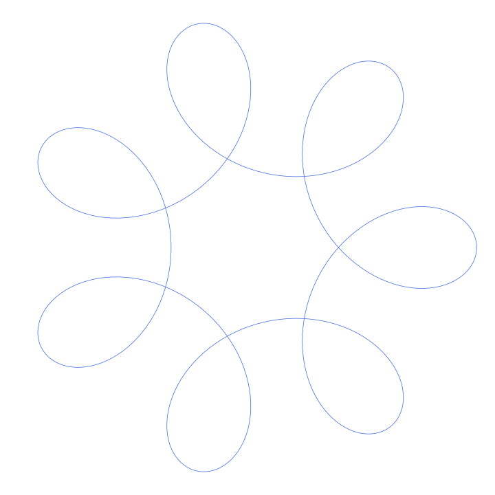
```

The `spiro` package can take things a little further than traditional spirographs:

```{r viridis_weave, eval=remake}
spiro(
  fixed_radius = 1231,
  cycling_radius = 529,
  pen_radius = 1233,
  color_groups = 67,
  color_cycles = 59,
  windings = 96,
  points_per_polygon = 50,
  file = "viridis_weave.svg"
) %>%
  add_background(color = "black") 


```

```{r, echo = F, fig.width=7, fig.height=7, out.width='100%', out.height='100%'}
knitr::include_graphics("viridis_weave.svg")
```

```{r cork, eval=remake}
spiro(
  fixed_radius = 800,
  cycling_radius = 677,
  pen_radius = 100,
  color_groups = 10,
  color_cycles = 61,
  windings = 677 * 0.5,
  transparency = 1,
  start_angle = 0,
  points_per_polygon = 30,
  colors = scico::scico(n = 10, palette = "cork"),
  end_at_beginning = F,
  draw_fills = F,
  file = "cork.svg"
) %>%
  add_background_gradient(
    colors = c("black", "black", "gray40"))
```

```{r, echo = F, fig.width=7, fig.height=7, out.width='100%', out.height='100%'}
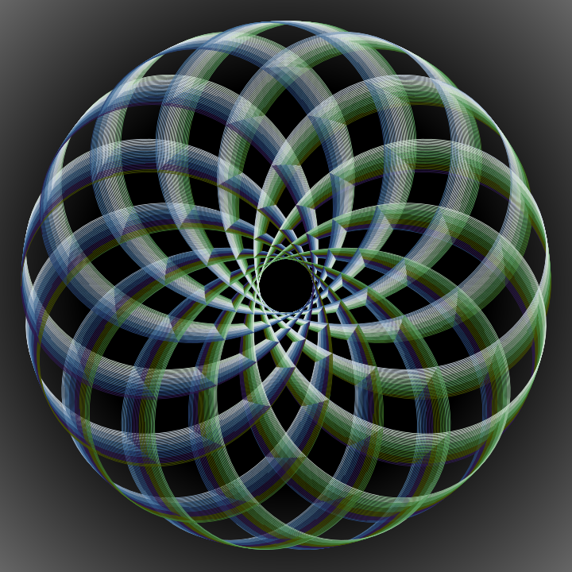
```

```{r purple_midnight, eval=remake}
spiro(
  file = "purple_midnight.svg",
  fixed_radius = 800,
  cycling_radius = 751,
  pen_radius = 40,
  color_groups = 4,
  color_cycles = 2,
  points_per_polygon = 5000,
  colors = c(
    "midnightblue", 
    "white", 
    "purple4", 
    "white")) %>%
  add_lines(
    colors = "black",
    line_width = 0.15) %>%
  add_background_gradient(
    colors = c("black",
               "purple4", 
               "black",
               "midnightblue", 
               "black", 
               "gray20"),
    stops = c(0,0.25,0.63,0.67,0.70,1)) 

```

```{r, echo = F, fig.width=7, fig.height=7, out.width='100%', out.height='100%'}
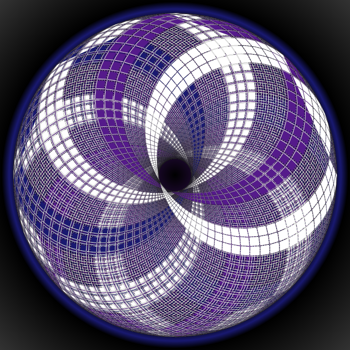
```


```{r royalfire_weave, eval=remake}
spiro(
  fixed_radius = 359,
  cycling_radius = 261,
  pen_radius = 40,
  color_groups = 36,
  color_cycles = 36,
  draw_fills = F,
  points_per_polygon = 10,
  line_width = 3.5,
  file = "royalfire_weave.svg",
  colors = c(
    scales::div_gradient_pal(
      low = "royalblue4",
      mid = "black",
      high = "firebrick4")(seq(0, 1, length.out = 18)),
    scales::div_gradient_pal(
      low = "royalblue",
      mid = "white",
      high = "firebrick")(seq(0, 1, length.out = 18))
    )
  ) %>% 
  add_background(color = "gray10") 

```

```{r, echo = F, fig.width=7, fig.height=7, out.width='100%', out.height='100%'}
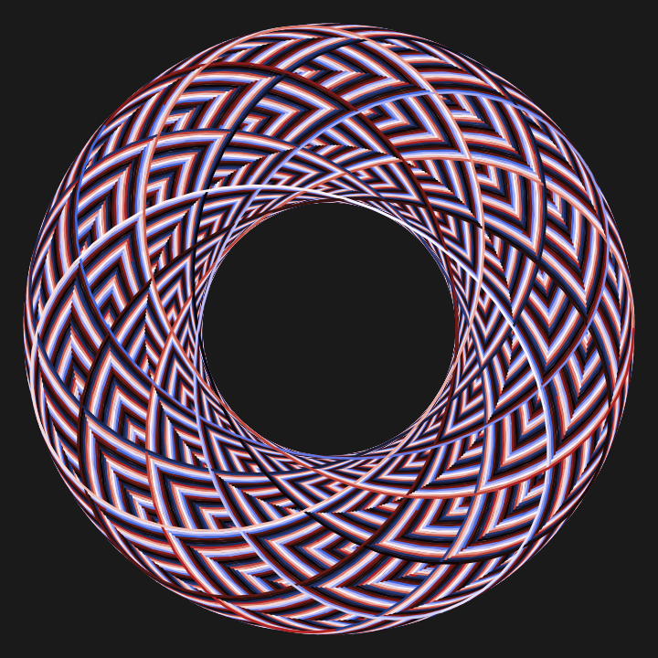
```

```{r spiralstar, eval=remake}
k <- 36
files <- paste0("s", 1:k, ".svg")
pen_radii <- seq(3.8, 1.5, length.out = k)
alphas <- rep_len(c(0.85, rep(0.2, 4)), k)
colors <- rep_len(scico::scico(6, palette = "devon"), k) %>% 
           scales::alpha(alpha = alphas) 

tibble::tibble(
  file = files,
  pen_radius = pen_radii,
  colors = colors) %>%
  purrr::pmap_chr(
    spiro,
    fixed_radius = 7,
    cycling_radius = 4,
    rotation = -pi / 10,
    points_per_polygon = 500,
    draw_fills = T,
    xlim = c(-7, 7),
    ylim = c(-7, 7)) %>%
  image_merge(
    output = "spiralstar.svg", 
    delete_input = TRUE) %>%
  add_lines(colors = c(rep(NA,k - 1), "gray")) %>% 
  image_rotate(degrees = (1:k / 2.5)) %>% 
  add_background_gradient(
    colors = c(
      "#FFFFFF",
      "#26588E", 
      "#E5E3F9",
      "#283568",
      "#C8C3F3"),
    radius = 1, 
    rounding = 1, 
    stops = c(0.42,0.93,0.96,0.97,1))
```

```{r, echo = F, fig.width=7, fig.height=7, out.width='100%', out.height='100%'}
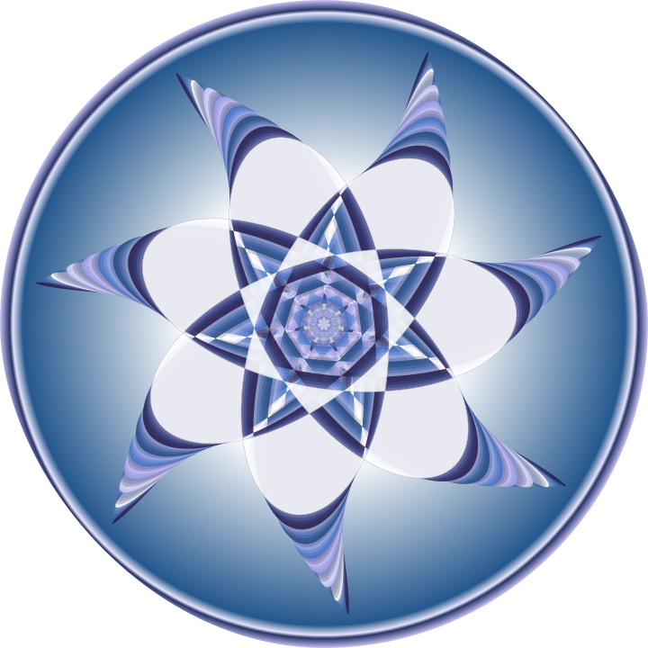
```

```{r oslo_aster, eval=remake}
n <- 10
oslo_colors <- scico::scico(
  n = n,
  palette = "oslo",
  alpha = 0.9) %>% 
  rev()

spiro(
  file = "oslo_aster.svg",
  rotation = pi / 6,
  points_per_polygon = 100
  ) %>%
  image_merge(output = "oslo_aster.svg", copies = n) %>%
  add_fills(colors = oslo_colors) %>%
  image_scale(scale = sqrt(0.75 ^ (seq(0, n - 1)))) %>%
  image_spin(rpm = 1:n + 1) %>%
  add_background(color = "black", rounding = 1)
```

```{r, echo = F, fig.width=7, fig.height=7, out.width='100%', out.height='100%'}
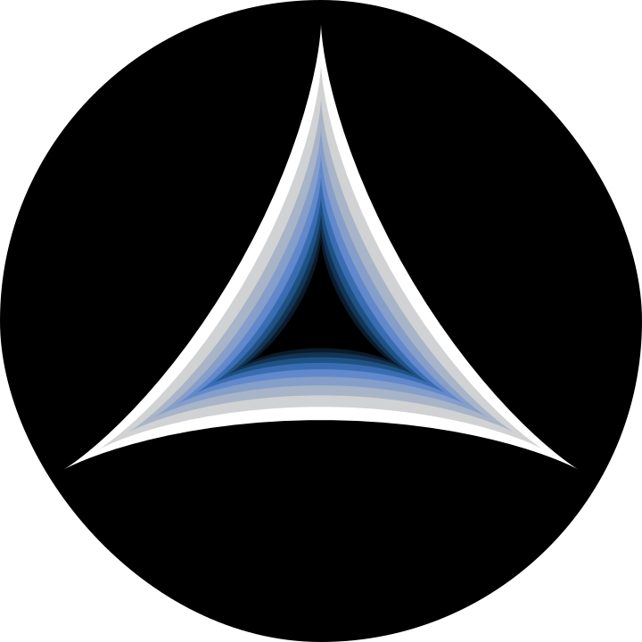
```

# What is a Spirograph?

A spirograph is made with a pen attached to a circle that rolls around another circle:

```{r, echo = F, fig.width=7, fig.height=7, out.width='100%', out.height='100%'}
knitr::include_graphics("animationsvg.gif")
```

# The `spiro` function

The primary function of the `spiro` package is the the `spiro` function. By default, it saves an .svg file to your working directory and opens the file in the program that opens .svg files by default. I recommend setting the default .svg viewer to Google Chrome so that you can see the animations that `spiro` can add to your spirographs. To change the default viewer in Windows see [here](https://support.microsoft.com/en-us/help/4028161/windows-10-change-default-programs). For [Mac](https://www.macrumors.com/how-to/change-a-files-default-app-in-macos/).

The basic parameters to play with on a spirograph are the radius of the fixed circle, the radius of the moving circle, and the pen placement radius inside the moving circle. To make the spirograph from the animation, the radius of the fixed circle is 3, the radius of the cycling circle is 1, and the radius of the pen placement is 2. Technically, this is a *hypotrochoid* because the moving circle is inside the fixed circle. 

```{r hypotrochoid, eval=remake}
spiro(
  fixed_radius = 3,
  cycling_radius = 1,
  pen_radius = 2,
  file = "hypotrochoid.svg")
```

```{r, echo = F, fig.width=7, fig.height=7, out.width='100%', out.height='100%'}
knitr::include_graphics("hypotrochoid.svg")
```

An *epitrochoid* is made with the moving circle outside the fixed circle.

```{r, echo = F, fig.width=7, fig.height=7, out.width='100%', out.height='100%'}
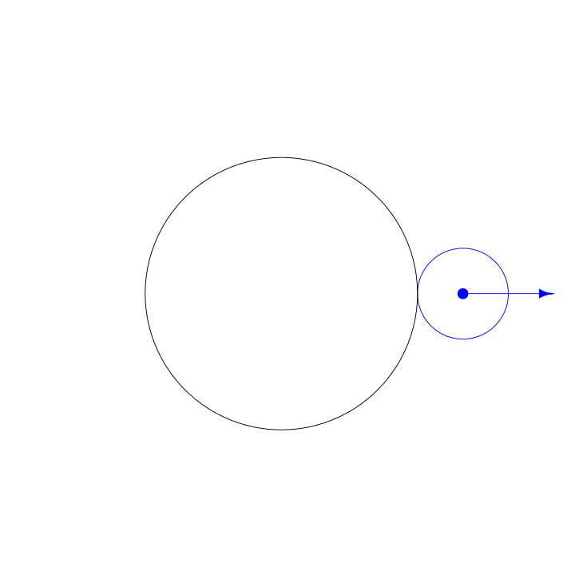
```

To make an *epitrochoid*, set the `cycling_radius` parameter to a negative value:

```{r epitrochoid, eval=remake}
spiro(
  fixed_radius = 3,
  cycling_radius = -1,
  pen_radius = 2,
  file = "epitrochoid.svg")
```

```{r, echo = F, fig.width=7, fig.height=7, out.width='100%', out.height='100%'}
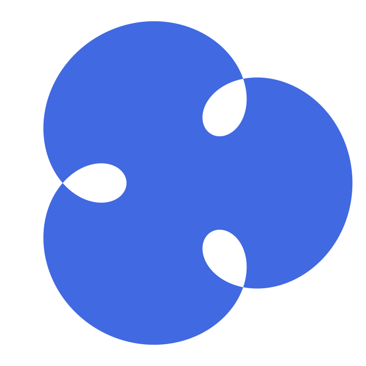
```

## Windings

In the animations above, the spirographs were complete after the small circle wound around the larger circle just once. Depending on the ratio of the `fixed_radius` to the `cycling_radius`, some spirographs need to wind more than once before the spirograph repeats itself. If you can reduce the fraction of `cycling_radius` / `fixed_radius` such that both the numerator and denominator are integers with no common factors, the reduced numerator is the number of times the spirograph winds before repeating.

By default, the number of windings is set to be equal to the `cycling_radius`. This means that you might accidentally make a spirograph that has repeated several. If the spirograph is blank, it is likely that the spirograph has repeated an even number of times. For example, if the spirograph repeats an even number of times, the fills will appear to be blank. For example, `fixed_radius` = 3, `cycling_radius` = 1 will produce a [deltoid](https://en.wikipedia.org/wiki/Deltoid_curve). If these parameters are doubled to 6 and 2, respectively, the shape will appear the same, but the fills will double up and disappear. However, if you set `draw_fills` to `FALSE` (or set the fill `rule` parameter is set to "winding"), you will see that the spirograph is there.

If you set either the `fixed_radius` or the `cycling_radius` to an irrational number (e.g., the square root of 2), the spirograph will never repeat itself---in theory. In practice, however, computers round irrational numbers, and thus the spirograph will repeat itself eventually. By using irrational numbers in either or both circles' radii, you can see that playing with with the `windings` parameter can give startlingly different results.

```{r root3a, eval=remake}
spiro(
  fixed_radius = sqrt(3),
  cycling_radius = 1, 
  windings = 14.7,
  file = "root3a.svg")
```

```{r, echo = F, fig.width=7, fig.height=7, out.width='100%', out.height='100%'}
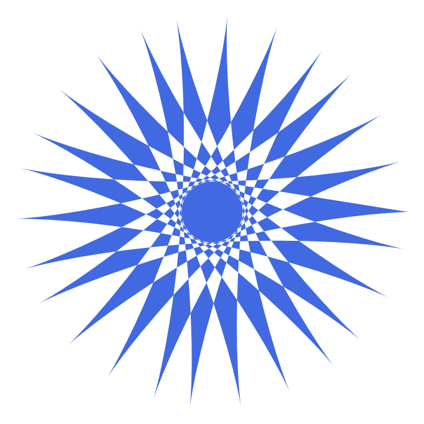
```

Same radii but with more windings:

```{r root3b, eval=remake}
spiro(
  fixed_radius = sqrt(3),
  cycling_radius = 1, 
  windings = 35.495, 
  file = "root3b.svg")
```

```{r, echo = F, fig.width=7, fig.height=7, out.width='100%', out.height='100%'}
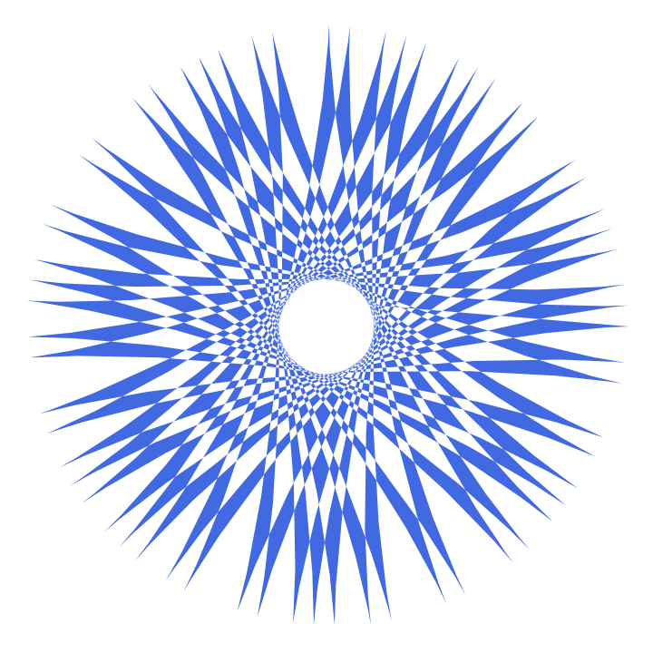
```

## Fills vs. Lines

If you want just lines instead of fills, set `draw_fills` to FALSE:

```{r epitrochoid_lines, eval = remake}
spiro(
  fixed_radius = 3,
  cycling_radius = -1,
  pen_radius = 2,
  draw_fills = FALSE,
  file = "epitrochoid_lines.svg")
```

```{r, echo = F, fig.width=7, fig.height=7, out.width='100%', out.height='100%'}
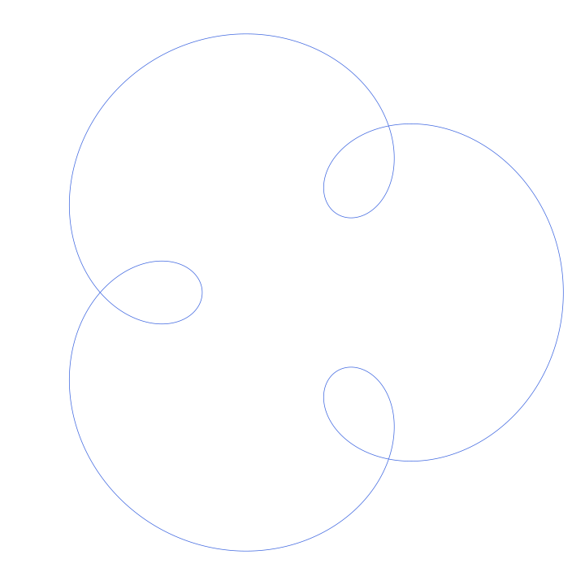
```


If you want lines and fills together, draw a filled spirograph, and then color the lines with the `add_lines` function.

Because the spiro function outputs the name of the file it creates and the first parameter of the `add_lines` function is the name of the input file, it is possible to to use the `add_lines` function with a pipe function (`%>%`) workflow.

```{r epitrochoid_add_lines, eval = remake}
spiro(
  fixed_radius = 3,
  cycling_radius = -1,
  pen_radius = 2,
  file = "epitrochoid_add_lines.svg"
  ) %>%
  add_lines(
    colors = "black",
    line_width = 4)
```

```{r, echo = F, fig.width=7, fig.height=7, out.width='100%', out.height='100%'}

```

# Using Color

## Color Groups

The figure can be split into multiple parts. Setting the `color_groups` parameter to 2, splits the figure in half:

```{r six_points, eval = remake}
spiro(
  fixed_radius = 6,
  cycling_radius = 5,
  pen_radius = 5,
  color_groups = 2,
  file = "six_points.svg")
```

```{r, echo = F, fig.width=7, fig.height=7, out.width='100%', out.height='100%'}
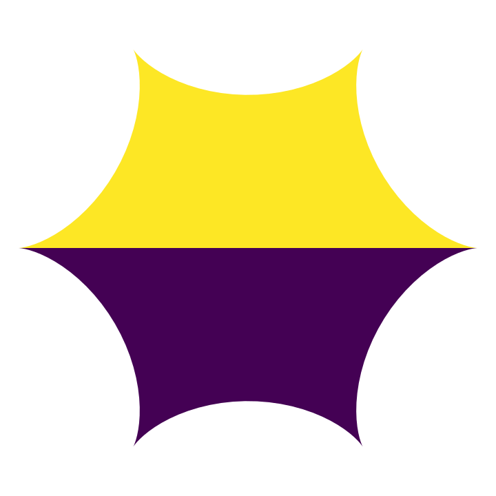
```

## Color Palettes

By default, the colors are selected from the viridis palette via the `scales` package. If you want to select different colors, you can do so directly with a vector of colors:

```{r six_points_blueblack, eval = remake}
spiro(
  fixed_radius = 6,
  cycling_radius = 5,
  pen_radius = 5,
  color_groups = 2, 
  colors = c("blue", "black"),
  file = "six_points_blueblack.svg")
```

```{r, echo = F, fig.width=7, fig.height=7, out.width='100%', out.height='100%'}
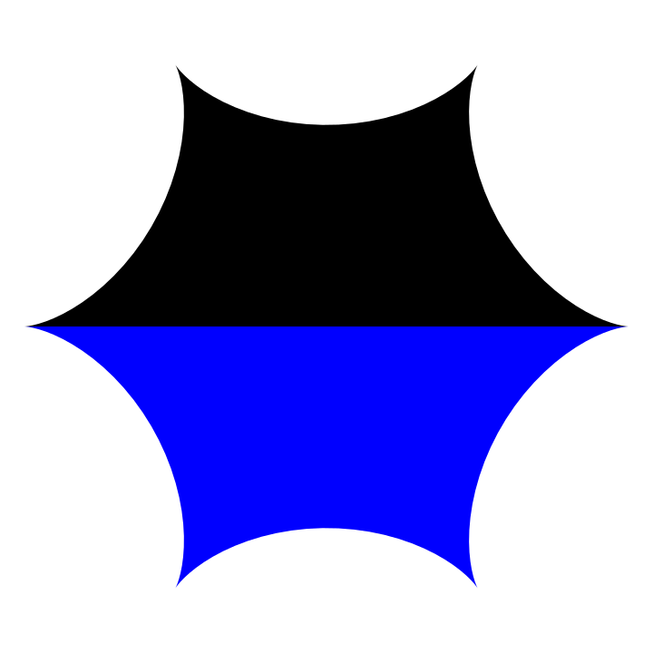
```

You can use any color palette as well. Here we use the rainbow palette:

```{r six_points_rainbow, eval = remake}
spiro(
  fixed_radius = 6,
  cycling_radius = 5,
  pen_radius = 5,
  color_groups = 12,
  colors = rainbow(12),
  file = "six_points_rainbow.svg")
```

```{r, echo = F, fig.width=7, fig.height=7, out.width='100%', out.height='100%'}
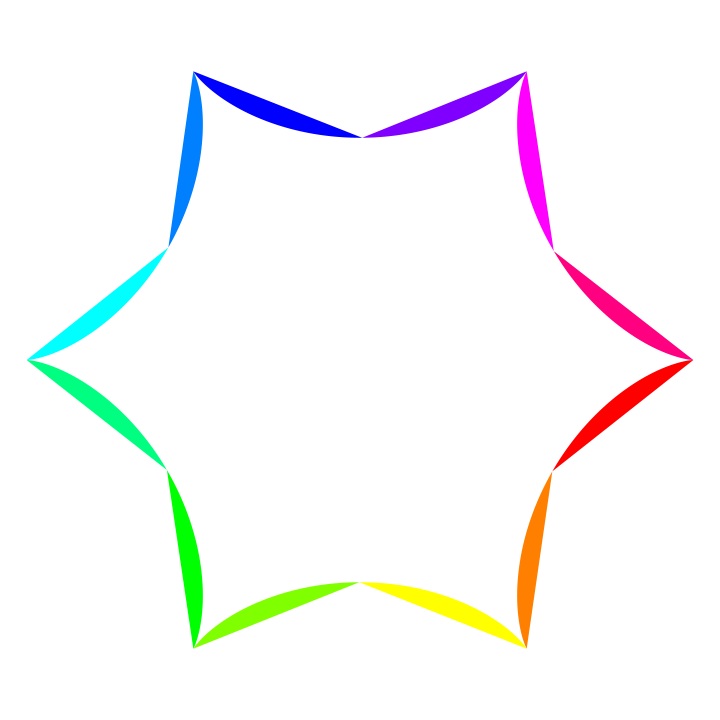
```

A great list of color palettes and functions can be found in Emil Hvitfeldt's [paletteer](https://github.com/EmilHvitfeldt/paletteer#included-packages) package.

## Color Recycling

Imagine that an image has 30 points and 5 colors. This means that there are 5 groups of 6 points to make 6-sided polygons (or lines). If you set the `color_cycles` parameter to 2, `spiro` will cycle through the 5 colors twice. Thus, there will be 10 groups of 3 points each to create polygons (or lines). There will be 2 polygons of each color.

You can recycle the colors as many times as you wish. Here are 12 colors recycled 3 times (i.e., `color_cycles` = 3). Thus, there are 3&nbsp;&times;&nbsp;12&nbsp;=&nbsp;36 segments in this spirograph.

```{r six_points_rainbow_3, eval = remake}
spiro(
  fixed_radius = 6,
  cycling_radius = 5,
  pen_radius = 5,
  color_groups = 12,
  colors = rainbow(12),
  color_cycles = 3,
  points_per_polygon = 80,
  file = "six_points_rainbow_3.svg")
```

```{r, echo = F, fig.width=7, fig.height=7, out.width='100%', out.height='100%'}
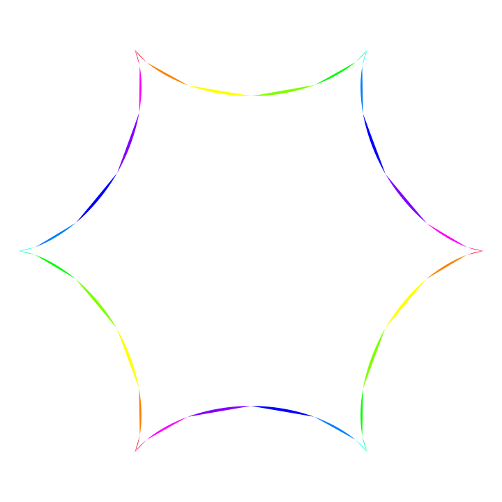
```

Recycling colors can dramatically change the look of the figure. Here is a single cycle of 5 colors:

```{r blurry_checkers, eval = remake}
spiro(
  fixed_radius = 121,
  cycling_radius = 100,
  pen_radius = 13,
  color_groups = 5,
  color_cycles = 1,
  points_per_polygon = 1000,
  transparency = .5,
  file = "blurry_checkers.svg"
  ) %>%
  add_background(color = "black")
```

```{r, echo = F, fig.width=7, fig.height=7, out.width='100%', out.height='100%'}
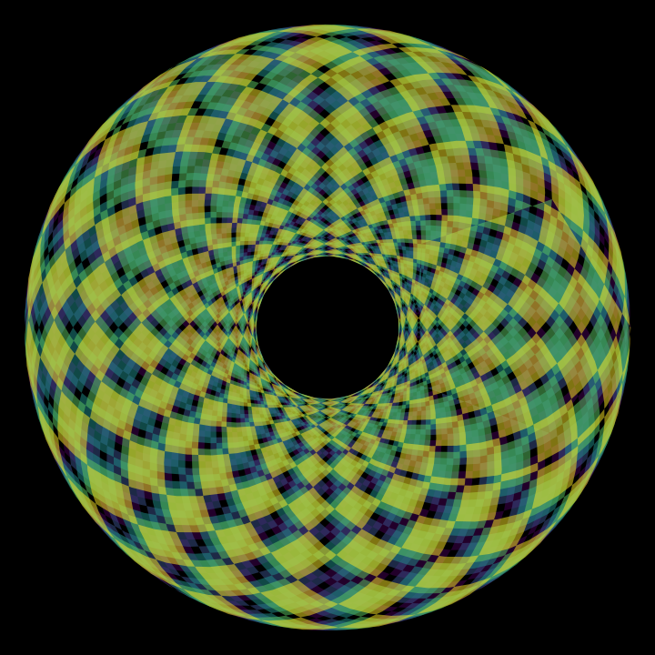
```

Here is the spirograph with the same 5 colors recycled 200 times:

```{r blurry_circles, eval = remake}
spiro(
  fixed_radius = 121,
  cycling_radius = 100,
  pen_radius = 13,
  color_groups = 5,
  color_cycles = 200,
  points_per_polygon = 20,
  transparency = 0.5,
  file = "blurry_circles.svg"
  ) %>%
  add_background(color = "black") 
```

```{r, echo = F, fig.width=7, fig.height=7, out.width='100%', out.height='100%'}
knitr::include_graphics("blurry_circles.svg")
```

Notice that the `points_per_polygon` was set to a lower value in the example above. By default, each recycled group has 1000 points each time the figure winds around the fixed circle. By default, the number of windings is equal to the cycling radius. In this example, that would mean 5 color groups &times; 200 color cycles &times; 100 windings, &times; 1000 points = 100 million points. By setting `points_per_polygon` to 20, there are now "only" 5 color groups &times; 200 color cycles &times; 20 points = 20,000 points. This means that the file size will be much smaller and the image quality is not noticeably reduced.

# Set Image Background

## Basic Background

You can set the background using the pipe (`%>%`) operator and the `add_background`

```{r rainbowspikes, eval = remake}
rainbow_colors <- hsv(
    h = seq(1 / 16, 1, length.out = 16),
    s = 0.7,
    v = 0.7)

spiro(
  fixed_radius = 16,
  cycling_radius = 5,
  pen_radius = 5,
  file = "rainbowspikes.svg",
  color_groups = 16,
  color_cycles = 2,
  points_per_polygon = 50,
  colors = rainbow_colors
  ) %>%
  add_background(color = "gray80")
```

```{r, echo = F, fig.width=7, fig.height=7, out.width='100%', out.height='100%'}
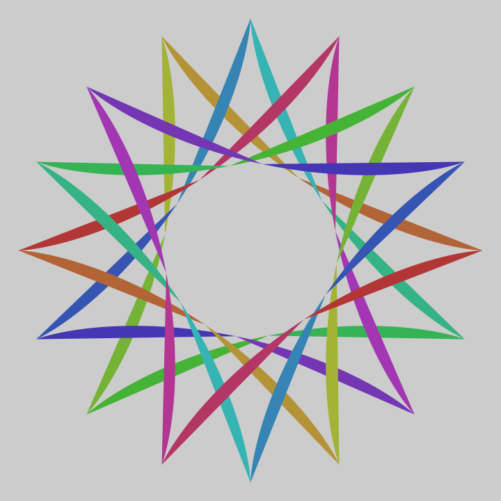
```

## Rounded Corners

You can round the corners if you wish. Rounding ranges from 0 to 1, with 0 being a square and 1 being a circle. Here the corners are set so that 10% of each side is rounded.

```{r rainbowspikes_rounded, eval = remake}
spiro(
  fixed_radius = 16,
  cycling_radius = 5,
  pen_radius = 5,
  file = "rainbowspikes_rounded.svg",
  color_groups = 16,
  color_cycles = 2,
  points_per_polygon = 50,
  colors = rainbow_colors
  ) %>%
  add_background(color = "gray80", rounding = 0.1)
```

```{r, echo = F, fig.width=7, fig.height=7, out.width='100%', out.height='100%'}
knitr::include_graphics("rainbowspikes_rounded.svg")
```

## Radial Gradients

If you want a radial gradient background, use the `add_background_gradient` function. You can set the colors and the stops. If you do not set the stops manually, they will be evenly spaced from 0 to 1.

```{r blue_gem, eval=remake}
spiro(
  fixed_radius = 21,
  cycling_radius = -20,
  pen_radius = 35,
  transparency = 1,
  colors = "black",
  file = "blue_gem.svg"
  ) %>%
  add_lines(colors = "white") %>%
  add_background_gradient(
    colors = c(
      rep(c("lightcyan2", "royalblue4"), 9),
      rep("white",2)), 
    rounding = 1, 
    radius = 1) 
```

```{r, echo = F, fig.width=7, fig.height=7, out.width='100%', out.height='100%'}
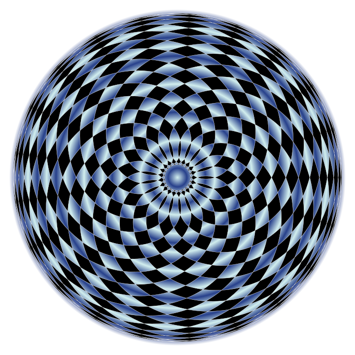
```

Here is an example of manually setting gradient stops:

```{r rainbowspikesdonut, eval = remake}
spiro(
  fixed_radius = 16,
  cycling_radius = 5,
  pen_radius = 5,
  file = "rainbowspikesdonut.svg",
  color_groups = 16,
  color_cycles = 2,
  points_per_polygon = 50,
  colors = rainbow_colors,
  transparency = 0.7
  ) %>%
  add_background_gradient(
    colors = c("white", "black", "black", "white"),
    stops = c(.27, .34, .93, 1), 
    rounding = 1, 
    radius = 1)
```

```{r, echo = F, fig.width=7, fig.height=7, out.width='100%', out.height='100%'}
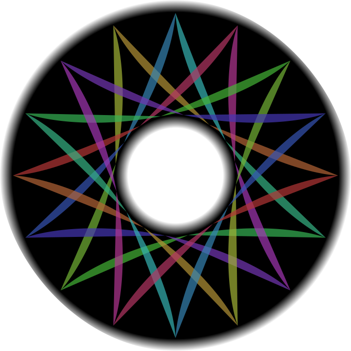
```

In the above image, the rounding was set to 1 to make a circular background. The radius was set to 1 so that the gradient would extend to the edge of the circle. The default radius of $\sqrt{2}$ extends to the corner of a square background.

# Merging images

Let's merge two .svg images starting with this image:

```{r, eval = remake}
spiro(
  fixed_radius = 3,
  cycling_radius = 1,
  colors = "royalblue",
  file = "deltoid_blue.svg") 
```

```{r, echo = F, fig.width=7, fig.height=7, out.width='100%', out.height='100%'}
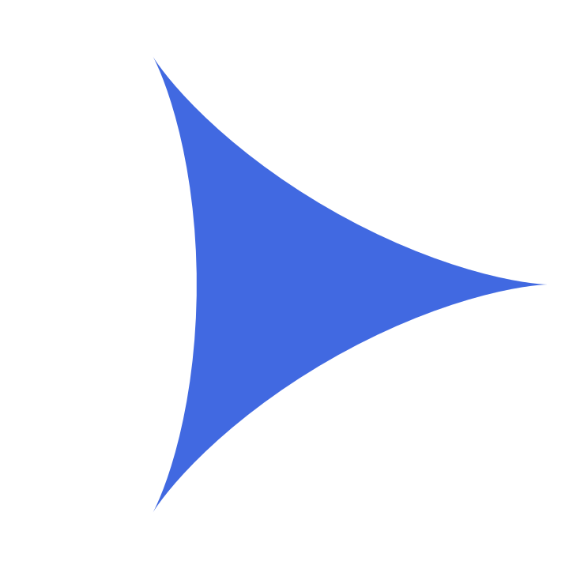
```

Now let's make the same image but rotated 60 degrees and in a different color:

```{r, eval = remake}
spiro(
  fixed_radius = 3,
  cycling_radius = 1,
  rotation = 60 / 180 * pi,
  colors = "firebrick",
  file = "deltoid_red.svg") 
```

```{r, echo = F, fig.width=7, fig.height=7, out.width='100%', out.height='100%'}
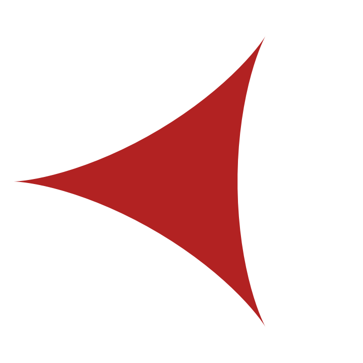
```

Now let's merge the images:

```{r deltoid_merge, eval = remake}
image_merge(
  input = c("deltoid_blue.svg", "deltoid_red.svg"),
  output = "redblue.svg") 
```

```{r, echo = F, fig.width=7, fig.height=7, out.width='100%', out.height='100%'}
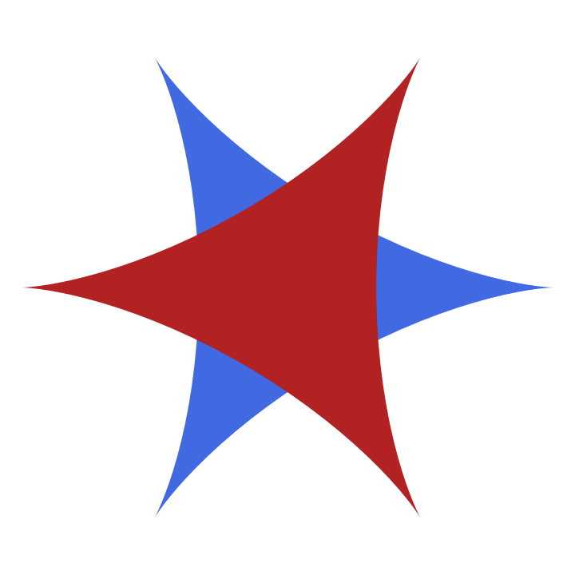
```

It is possible to merge more than two images. In this example, six images are created as a vector. If we leave the file name unspecified, the spiro function will generate a unique file name for each image. These individual files will be deleted because we have set the `delete_input` parameter to `TRUE` in the `image_merge` function.

```{r dodgerblue_snowflake, eval = remake}
c(spiro(
    fixed_radius = 17,
    cycling_radius = 3,
    colors = "dodgerblue4"),
  spiro(
    fixed_radius = 17,
    cycling_radius = 4, 
    colors = "white"),
  spiro(
    fixed_radius = 17,
    cycling_radius = 5,
    colors = "dodgerblue3"),
  spiro(
    fixed_radius = 17,
    cycling_radius = 6,
    colors = "white"),
  spiro(
    fixed_radius = 17,
    cycling_radius = 7,
    colors = "dodgerblue2"),
  spiro(
    fixed_radius = 17,
    cycling_radius = 8,
    colors = "white")) %>%
  image_merge(
    output = "dodgerblue_snowflake.svg", 
    delete_input = TRUE)
```

```{r, echo = F, fig.width=7, fig.height=7, out.width='100%', out.height='100%'}
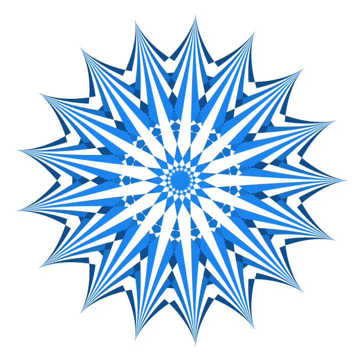
```

This kind of multi-layer spirograph can be created more efficiently by specifying a tibble with the parameters we want to vary. Then we pipe the tibble into the `pmap` function from the `purrr` package,  which will apply the `spiro` function to each row in the tibble. We use the `pmap_chr` variant of `pmap` because we want to be sure that the output is a vector of file names (i.e., in the "character" format). 

The spirograph produced by the code below is the same as above, and thus the image is not duplicated.

```{r, eval=FALSE}
library(purrr)
tibble::tibble(
  points_per_polygon = 1000,
  fixed_radius = 17,
  cycling_radius = 3:8,
  colors = c(
    "dodgerblue4", "white",
    "dodgerblue3", "white",
    "dodgerblue2", "white")
  ) %>% 
  pmap_chr(spiro) %>%
  image_merge(
    output = "dodgerblue_snowflake.svg", 
    delete_input = TRUE) 

```

# Transforming images

## Re-scaling Images

By default, the `spiro` function makes the image as large as possible by setting the plot limits to the most extreme point (i.e., the point with the largest *r* in polar coordinates. For example, if the most extreme point is 6 units from the center, the limits of the x and y axes will be &pm;6. One way to change the size of the spirograph is to set the limits manually with the `xlim` and `ylim` parameters. Doing so often involves trial-and-error to obtain the desired results.

An alternative is to change the size of the image with the `image_scale` function. This function does not alter the underlying data but transforms the .svg image directly.

```{r heptagon_petals, eval = remake}
spiro(
  fixed_radius = 7,
  cycling_radius = 1,
  pen_radius = 3,
  colors = "darkorchid",
  file = "heptagon_petals.svg"
  ) %>%
  image_scale(scale = 0.4) 
```

```{r, echo = F, fig.width=7, fig.height=7, out.width='100%', out.height='100%'}
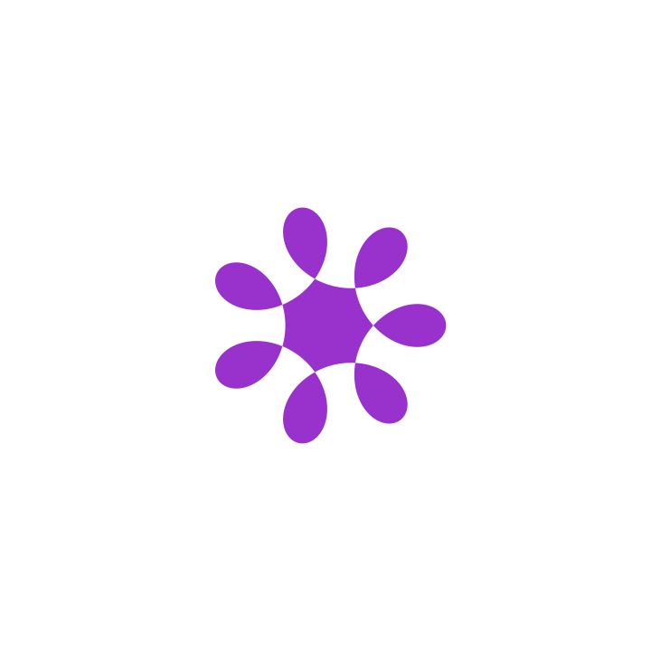
```

This function is useful when  you wish to merge images of different sizes.

```{r seven_loops, eval = remake}
c(
  spiro(
    fixed_radius = 7,
    cycling_radius = -1,
    pen_radius = 3,
    colors = "darkorchid",
  ),
  spiro(
    fixed_radius = 7,
    cycling_radius = 1,
    pen_radius = 3,
    colors = "white",
    ) %>%
    image_scale(scale = 0.4)
  ) %>%
  image_merge(
    output = "heptagon_petals_merged.svg", 
    delete_input = TRUE)
```

```{r, echo = F, fig.width=7, fig.height=7, out.width='100%', out.height='100%'}
knitr::include_graphics("heptagon_petals_merged.svg")
```

## Rotating Images

The `spiro` function has a `rotation` parameter that determines the rotation of the image and alters the data points directly. However, sometimes you want to rotate the image after it has been created. The `image_rotate` function inserts a transform rotate statement into the .svg file. All transforms (i.e., shifting, rotating, and rescaling) are cumulative in .svg, and thus the order in which they are performed will produce different results.

You can specify the rotation in the `degrees` parameter by default, but if you specify the rotation in the `radians`, any values in the `degrees` parameter will be ignored.

```{r hsv_stripes, eval=remake}
hsv_s <- rep(c(1,0),10)  + rep(c(-1,1),10) * seq(0.3,0.8,length.out = 20)

spiro(
  fixed_radius = 6,
  cycling_radius = -1,
  pen_radius = 1,
   rotation = pi / 6,
  points_per_polygon = 500
  ) %>%
  image_merge(
    output = "hsv_stripes.svg", 
    copies = 20, 
    delete_input = TRUE
    ) %>%
  add_fills(
    colors = hsv(
      h = rep(seq(0,.90,0.1), 2), 
      v = rep(c(0.4,.7),10),
      s = hsv_s)
    ) %>%
  image_scale(scale = seq(1, 0, length.out = 21)[-21]) %>% 
  image_rotate(degrees = 0:19 * 5) %>% 
  add_background(rounding = 1)
```

```{r, echo = F, fig.width=7, fig.height=7, out.width='100%', out.height='100%'}
knitr::include_graphics("hsv_stripes.svg")
```

## Shifting Images

In this example, we create 9 copies of a spirograph, give each copy a different color, and then shift the x and y coordinates.

```{r rainbowsequence, eval = remake}
k <- 9
spiro(
  fixed_radius = 8,
  cycling_radius = 5,
  pen_radius = 2,
  draw_fills = F, 
  colors = "black", 
  line_width = 0.1
  ) %>% 
  image_scale(0.8) %>% 
  image_merge(
    output = "rainbowsequence.svg", 
    copies = k, 
    delete_input = TRUE
    )  %>% 
  add_fills(colors = rainbow(k, alpha = .25)) %>% 
  image_shift(
    x = seq(-1,1,length.out = k) * -60,
    y = seq(-1,1,length.out = k) * 15) 
```

```{r, echo = F, fig.width=7, fig.height=7, out.width='100%', out.height='100%'}
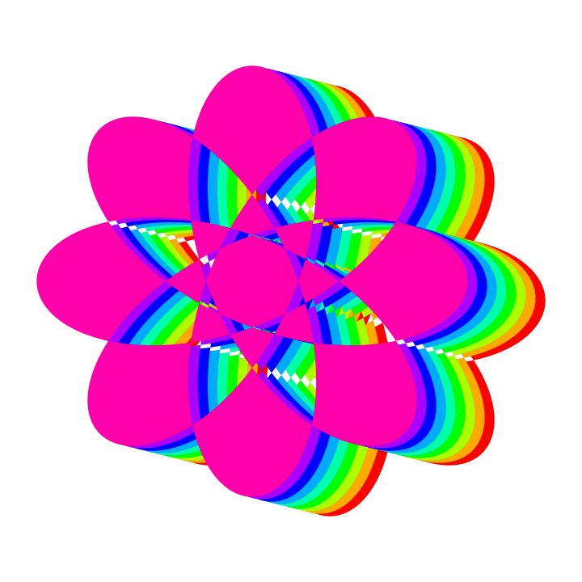
```

# Animating Spirographs

One of the primary reasons I chose to make

Unfortunately, the animations produced with the `spiro` package are not viewable by all programs that display svg files. These animations work with the Google Chrome browser. They may work, with varying degrees of smoothness in other browsers (e.g., Mozilla Firefox). They do not work in Microsoft Edge or Microsoft Internet Explorer.

## Spinning Spirographs

The `image_spin` function takes file name of an svg file created by the `spiro` function and adds an `animateTransform` node to the .svg. To spin clockwise, set the `rpm` parameter to a postie number. To spin counter-clockwise, set the `rpm` parameter to a negative number.

This spirograph may not seem particularly interesting:

```{r purple, eval = remake}
spiro(
  colors = "purple",
  fixed_radius = 16,
  cycling_radius = 15,
  pen_radius = 1.5,
  draw_fills = FALSE,
  line_width = 4,
  file = "purple.svg"
)
```

```{r, echo = F, fig.width=7, fig.height=7, out.width='100%', out.height='100%'}
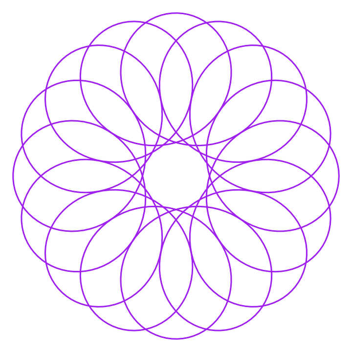
```

This one looks almost identical to it:

```{r black, eval = remake}
spiro(
  colors = "black",
  fixed_radius = 15,
  cycling_radius = 14,
  pen_radius = 1.5,
  draw_fills = FALSE,
  line_width = 4,
  file = "black.svg"
)
```

```{r, echo = F, fig.width=7, fig.height=7, out.width='100%', out.height='100%'}
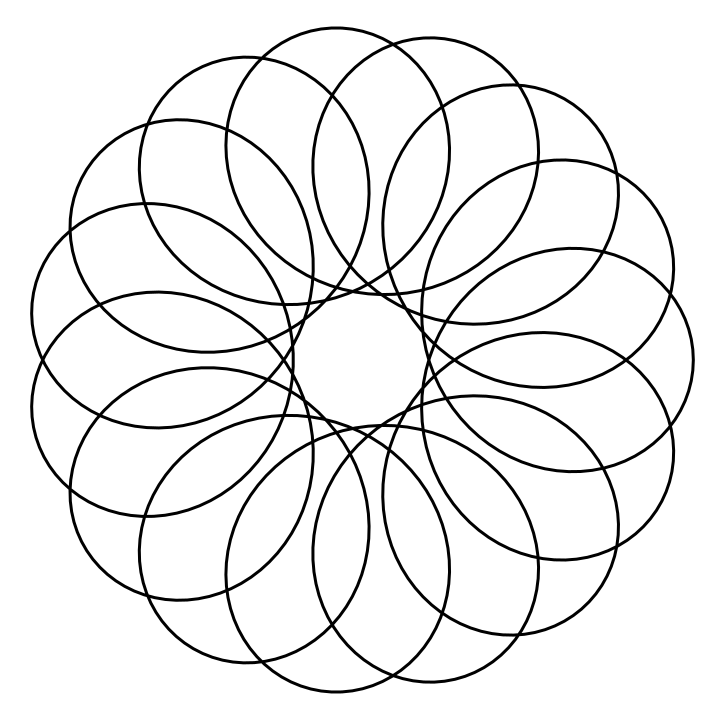
```

However, with a black background, spinning the two images produces this unexpected effect:

```{r purple_cycle, eval = remake}
image_merge(
  input = c("purple.svg", "black.svg"), 
  output = "purple_cycle.svg") %>%
  image_spin(rpm = c(0.5,-0.5)) %>%
  add_background(color = "black")
```

```{r, echo = F, fig.width=7, fig.height=7, out.width='100%', out.height='100%'}
knitr::include_graphics("purple_cycle.svg")
```

### Merged Spins with the Pipe Operator


We can merge and spin images in a streamlined workflow. By default, the output of the spiro function is the file name. Thus, we can use the pipe operator `%>%` from the `magrittr` package to string commands together.  If we merge the images first, the rotations can be specified with a vector.

Suppose we have a static image we want to spin:

```{r static, eval = remake}
spiro(
  file = "Static.svg",
  fixed_radius = pi,
  cycling_radius = sqrt(8),
  pen_radius = 0.5 * sqrt(8) / pi ,
  windings = 81,
  start_angle = 0,
  points_per_polygon = 10000,
  transparency = 0.7
) 
```

```{r, echo = F, fig.width=7, fig.height=7, out.width='100%', out.height='100%'}
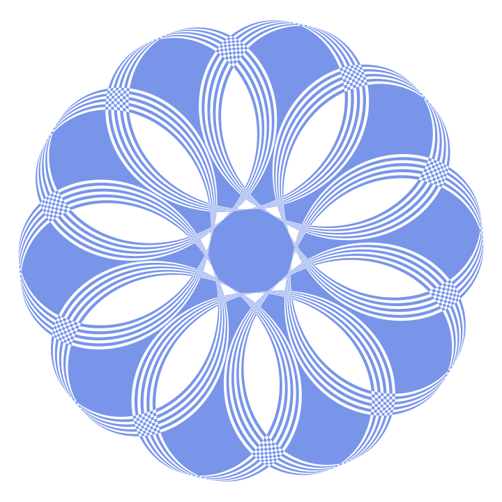
```

This is a nice spirograph already, but it becomes especially groovy when 2 copies are merged and spun slowly in opposite directions.

```{r SpinLeftRight, eval = remake}
spiro(
  fixed_radius = pi,
  cycling_radius = sqrt(8),
  pen_radius = 0.5 * sqrt(8) / pi ,
  windings = 81,
  start_angle = 0,
  points_per_polygon = 10000,
  transparency = 0.7
  ) %>% 
  image_merge(
    output = "SpinLeftRight.svg", 
    copies = 2, 
    delete_input = TRUE
    ) %>% 
  image_spin(rpm = c(-0.1,0.1))
```

```{r, echo = F, fig.width=7, fig.height=7, out.width='100%', out.height='100%'}
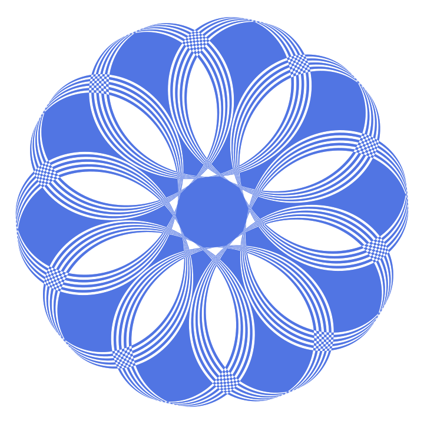
```

### Off-Center Rotations

The `image_spin` function spins the image around its center by default, but off-center rotations are possible. Here we spin an image around a point not at the center. Imagine the image is a square of size 1. The top left corner is point (0,0) and the bottom right corner is point (1,1). The center is point (0.5,0.5). Here we spin the image around the point (0.25,0.38), which centered horizontally but a little above the vertical center. I have added a red dot to show the point around which the image is rotating.

```{r off_center, eval = remake}
spiro(
  fixed_radius = 5,
  cycling_radius = 3,
  pen_radius = 3 ,
  start_angle = 0,
  rotation = pi / 2,
  file = "off_center.svg"
) %>%
  image_spin(
    rpm = 5,
    rotation_point = c(0.5, 0.385),
    add_dot = TRUE
  ) 
```

```{r, echo = F, fig.width=7, fig.height=7, out.width='100%', out.height='100%'}
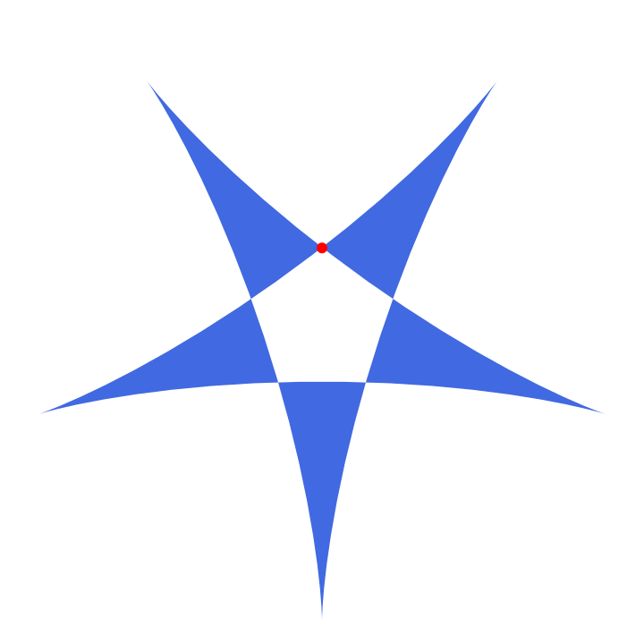
```

## Animated Pathdots

You can make dots trace your paths:

```{r pathdot1, eval = remake}
spiro(
  fixed_radius = 5,
  cycling_radius = 1,
  pen_radius = 11 / 3,
  draw_fills = FALSE,
  rotation = pi / 10, 
  file = "pathdot1.svg"
  ) %>%
  add_pathdot()
```

```{r, echo = F, fig.width=7, fig.height=7, out.width='100%', out.height='100%'}
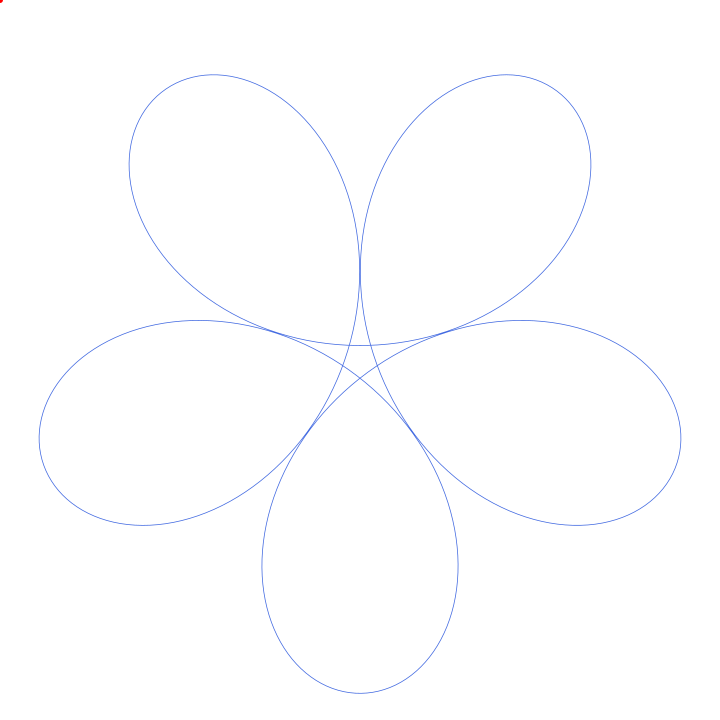
```

If your spirograph has multiple colors and multiple groups, a pathdot will be added to each one. You can also set the duration of the animation in seconds.

```{r pathdot5, eval = remake}
# Make Colors
pathcolors <- scales::viridis_pal()(5)[c(4, 5, 1, 2, 3)]

spiro(
  fixed_radius = 5,
  cycling_radius = 1,
  pen_radius = 11 / 3,
  start_angle = pi,
  color_groups = 5,
  draw_fills = FALSE,
  line_width = 10,
  rotation = pi / 10,
  file = "pathdot5.svg"
  ) %>%
  add_pathdot(
    colors = pathcolors,
    duration = 3)
```

```{r, echo = F, fig.width=7, fig.height=7, out.width='100%', out.height='100%'}
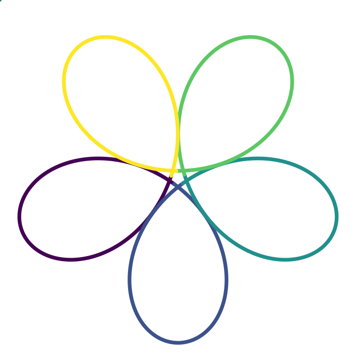
```

You can add multiple layers of pathdots. Here I have made all the lines white to make it seem that the dots are whizzing about on their own.

```{r pathdot25, eval = remake}
spiro(
  fixed_radius = 5,
  cycling_radius = 1,
  pen_radius = 11 / 3,
  color_groups = 5,
  colors = rep("white", 5),
  start_angle = pi,
  draw_fills = FALSE,
  rotation = pi / 10,
  file = "pathdot25.svg", points_per_polygon = 250
) %>%
  add_pathdot(duration = 2) %>%
  add_pathdot(duration = 3) %>%
  add_pathdot(duration = 4) %>%
  add_pathdot(duration = 5) %>%
  add_pathdot(duration = 6) 
```

```{r, echo = F, fig.width=7, fig.height=7, out.width='100%', out.height='100%'}
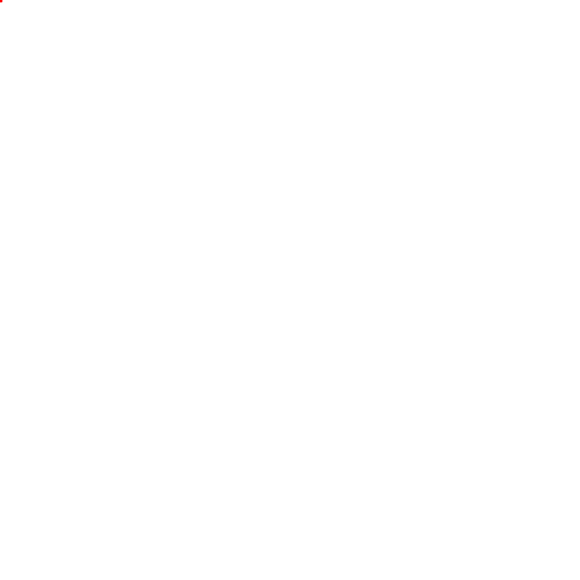
```

# Using with `ggplot2`

The `spiro` function normally returns the file name, but it is possible to return the raw data by setting `savefile` to FALSE. Thus, it is easy to use the data with `ggplot2` or any other plotting system you wish to use.

```{r spiro_data, dev="svg", fig.width=7, fig.height=7, out.height='100%', out.width='100%'}
library(ggplot2)
library(dplyr)
d <- spiro(
  fixed_radius = 37,
  cycling_radius = 12 ,
  pen_radius = 31,
  color_groups = 6,
  color_cycles = 6,
  points_per_polygon = 1000,
  savefile = FALSE
)

```

```{r spiro_ggplot2, dev="svg", fig.width=7, fig.height=7, out.width='100%', out.height='100%'}
d %>%
  mutate(color_id = factor(color_id),
         color_cycle_id = factor(color_cycle_id)) %>%
  ggplot(aes(x, y, color = color_cycle_id)) +
  geom_path(lwd = 1) +
  theme_void() +
  theme(legend.position = "none") +
  coord_equal()

```

# Bezier Strings

Bezier strings are my name for the string art I did when I was in elementary school. I thought they were amazing. They are not spirographs, though.

By default, the `string_bezier` function stars with strings on a right angle:

```{r bezier, eval = FALSE}
string_bezier(
  file = "bezier.svg",
  color = c("red","green", "blue"),
  n = 75)
```

```{r, echo = F, fig.width=7, fig.height=7, out.width='100%', out.height='100%'}
knitr::include_graphics("bezier.svg")
```


However, as long as there are at least 3 points on x and y, you can string these curves together. Here we have also added a background color.

```{r bezier_sequence, eval = FALSE}
string_bezier(
  file = "bezier_sequence.svg",
  x = c(-1, 1, 0,-1, 1,-1, 0, 1,-1, 1),
  y = c( 0, 0, 1, 0, 0, 0,-1, 0, 0, 0),
  color = c("#006B6B", "#FFFFFF", "black", "black", "black"),
  n = 200,
  lwd = 5,
  ljoin = 1
) %>%
  add_background(color = "#108998")
```

```{r, echo = F, fig.width=7, fig.height=7, out.width='100%', out.height='100%'}
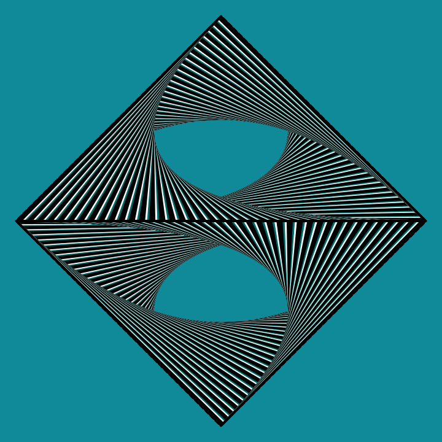
```


# Future development

The `spiro` package could be developed in a many ways. It is possible to extend the idea of spirographs to arbitrary shapes cycling around arbitrary shapes. The animations and transformations are still primitive. The animations may be better handled with d3. 

I look forward to seeing what people can create with `spiro`.
