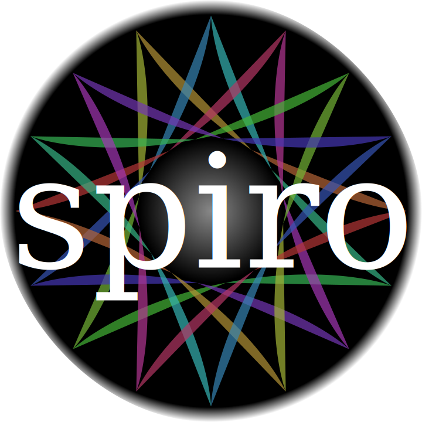

<!-- README.md is generated from README.Rmd. Please edit that file -->

```{r, echo = FALSE}
knitr::opts_chunk$set(
  collapse = TRUE,
  comment = "#>",
  fig.path = "README-"
)
```

# spiro <a href="https://wjschne.github.io/spiro/index.html"></a>


[](https://cran.r-project.org/package=spiro)
[](https://www.tidyverse.org/lifecycle/#maturing)

The spiro package creates spirographs in the .svg file format. There are functions in spiro that transform and animate your spirographs after they have been created.

* [Tutorial](https://wjschne.github.io/spiro/articles/HowToUse/spiro.html)
* [Gallery](https://wjschne.github.io/spiro/articles/Gallery/Gallery.html)
* [Function References](https://wjschne.github.io/spiro/reference/index.html)


## Installation

You can install spiro from github with:

```{r gh-installation, eval = FALSE}
# install.packages("remotes")
remotes::install_github("wjschne/spiro")
```

## Example

Here is a basic spirograph.

```{r example, eval=FALSE}
library(spiro)
spiro(
  fixed_radius = 11, 
  cycling_radius = 4, 
  pen_radius = 9, 
  file = "example.svg") 
```


## Code of Conduct

Please note that the spiro project is released with a [Contributor Code of Conduct](https://contributor-covenant.org/version/2/1/CODE_OF_CONDUCT.html). By contributing to this project, you agree to abide by its terms.

