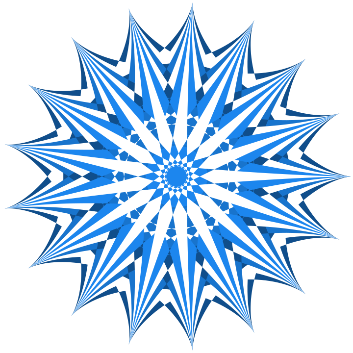

```{r setup, include=FALSE}
knitr::opts_chunk$set(echo = TRUE, cache = F, dev = "svg")
library(extrafont)
loadfonts("win")

# extrafont::ttf_import(paths = "C:/USERS/RENEE/APPDATA/LOCAL/MICROSOFT/WINDOWS/FONTS")
  
library(spiro)
library(tidyverse)
library(LaCroixColoR)
library(scico)
library(dutchmasters)
library(ochRe)
library(scales)
remake = FALSE
myfont <- "Cormorant"
update_geom_defaults("text", list(family = myfont))
update_geom_defaults("label", list(family = myfont))
```

As a kid, I *loved* making spirographs. I still do. Making them feels more like discovery than creativity, like finding hidden wings in the Mathematical Museum of Art. I have not yet found the point where spirographs no longer surprise me. 

The surprising variety of forms generated by spirographs are manifestations of just one equation, the [circular path troichoid](https://www.wikiwand.com/en/Hypotrochoid). The shape of the spirograph depends on the radius of a fixed circle, radius of a cycling circle, and the distance of the pen from the center of the the cycling circle.

$$\begin{align}
x (\theta) &= (R - r)\cos\theta + d\cos\left({R - r \over r}\theta\right)\\
y (\theta) &= (R - r)\sin\theta - d\sin\left({R - r \over r}\theta\right)
\end{align}
$$

> Where  
*R* is the radius of the fixed circle  
*r* is the radius of the cycling circle  
*d* is the distance of the pen from the center of the cycling circle  
*&theta;* is the number of radians the cycling circle travels around the fixed circle  
*x*(*&theta;*) is the position of *x* after the cycling circle travels *&theta;* radians  
*y*(*&theta;*) is the position of *y* after the cycling circle travels *&theta;* radians


```{r spriro_parameters, fig.cap="Three parameters of spirograph shapes", fig.height=7, fig.width=7, message=FALSE, warning=FALSE, out.height='100%', out.width='100%'}

cycling_radius <- 1 
fixed_radius <- 3
pen_radius <- 2

d_circle <- tibble(
  x0 = c(0, fixed_radius - cycling_radius),
  y0 = c(0, 0),
  radius = c(fixed_radius, cycling_radius),
  r_y = c(0, 0),
  r_x = c(-fixed_radius / 2, fixed_radius - 1.5 * cycling_radius),
  r_lab = c("Fixed\nRadius", "Cycling\nRadius"),
  color = c("black", "royalblue")
)

d_segment <- tibble(
  x = c(0, fixed_radius - cycling_radius, fixed_radius - cycling_radius),
  y = c(0, 0, 0),
  xend = c(-fixed_radius + 0.04, fixed_radius - cycling_radius * 2 + 0.04, fixed_radius - cycling_radius + pen_radius - 0.04),
  yend = c(0, 0, 0),
  color = c("black", "royalblue", "firebrick")
)

ggplot(data = d_circle) +
  theme_void() +
  ggforce::geom_circle(
    aes(
      x0 = x0,
      y0 = y0,
      r = radius,
      color = color),
    n = 1000) +
  coord_equal() +
  geom_text(
    aes(
      x = r_x,
      y = r_y,
      label = r_lab,
      color = color),
    vjust = 0.5,
    nudge_y = 0.015,
    angle = 0) +
  annotate(
    x = fixed_radius - cycling_radius + pen_radius / 2,
    y = 0.015,
    geom = "label",
    color = "firebrick",
    label = "Pen\nDistance",
    label.size = 0,
    label.padding = unit(3, "pt")) +
  geom_segment(
    data = d_segment,
    aes(x = x, y = y, xend = xend, yend = yend, color = color),
    geom = "segment",
    linejoin = "mitre",
    arrow = arrow(
      length = unit(0.025, "npc"),
      type = "closed",
      angle = 15)) +
  annotate(
    x = fixed_radius - cycling_radius,
    y = 0,
    geom = "point",
    color = "royalblue") +
  scale_color_identity() +
  theme(legend.position = "none")

```


Although I still like making spirographs by hand, I wanted to extend what could be done with the traditional spirograph. I wrote the [spiro package](https://wjschne.github.io/spiro/articles/HowToUse/spirograph.html) in R to make images that would be impossible to create on paper.

I cannot usually predict what will happen when I play with the three primary numbers of the equation. However, once a certain combination strikes me as interesting, I play with cutting it into different color segments to see if something of further interest happens. Sometimes I merge many spirographs and spin them to see if the emerging patterns are pleasing. 

Here I demonstrate what can be done with [spiro package](https://wjschne.github.io/spiro/articles/HowToUse/spirograph.html). I would love to see what you can do with it.


# Welcome Everyone

```{r, eval=remake}
spiro(
  fixed_radius = 1231,
  cycling_radius = 529,
  pen_radius = 1233, 
  colors = viridis::viridis(67),
  color_groups = 67,
  color_cycles = 59,
  windings = 96,
  points_per_polygon = 50,
  file = "viridis_weave.svg"
) %>%
  add_background(color = "gray8")
```

```{r, fig.width=7, fig.height=7, out.width='100%', out.height='100%', echo = F}
knitr::include_graphics("viridis_weave.svg")
```


# My Non-Canonical Backstory

```{r, eval=remake}
k <- 8
crossing(cycling_radius = 1:k, fixed_radius = k * 2 + 1) %>%
  rowid_to_column("id") %>%
  mutate(
    colors = lacroix_palette("Coconut", n = k , "continuous"),
    file = paste0("sdfds.", id, ".svg")
  ) %>%
  select(-id) %>%
  pmap(
    spiro,
    points_per_polygon = 2000,
    draw_fills = F,
    transparency = 0.9) %>%
  image_merge(
    output = "my_non_canonical_backstory.svg") %>%
  add_background()
```

```{r, fig.width=7, fig.height=7, out.width='100%', out.height='100%', echo = F}

```


# Licorice Donut Vivisection

```{r, eval=remake}
rainbow_colors <- hsv(
    h = seq(1 / 16, 1, length.out = 16),
    s = 0.7,
    v = 0.7)
  
spiro(
  fixed_radius = 16,
  cycling_radius = 5,
  pen_radius = 5,
  file = "licorice_donut_vivisection.svg",
  color_groups = 16,
  color_cycles = 2,
  points_per_polygon = 50,
  colors = rainbow_colors,
  transparency = 0.7) %>%
  add_background_gradient(
    colors = c("white", "black", "black", "white"),
    stops = c(.27, .34, .93, 1), 
    rounding = 1, 
    radius = 1)
```

```{r, fig.width=7, fig.height=7, out.width='100%', out.height='100%', echo = F}

```


# <span>When We Meet Again</span>,<br><span>Will We Be As We Were?</span>

```{r, eval=remake}
n <- 10
oslo_colors <- scico(
  n = n,
  palette = "oslo",
  alpha = 0.9) %>%
  rev()

spiro(
    file = "oslo_aster.svg",
    rotation = pi / 6,
    points_per_polygon = 100) %>%
  image_merge(
    output = "oslo_aster.svg",
    copies = n) %>%
  add_fills(
    colors = oslo_colors) %>%
  image_scale(
    scale = sqrt(0.75 ^ (seq(0, n - 1)))) %>%
  image_spin(
    rpm = 1:n + 1) %>%
  add_background(
    color = "black",
    rounding = 1) %>% 
  add_restart()
```


```{r, fig.width=7, fig.height=7, out.width='100%', out.height='100%', echo = F, results='asis'}
cat(readr::read_file("oslo_aster.svg"))
```


# <span>But for the Darkness</span><br><span>Nothing Shimmers</span>

```{r, eval=remake}
set.seed(105)
k <- 15
bg_colors <- paste0("gray", sample(1:k, k))

bg_stops <- sort(runif(k))

spiro(
  fixed_radius = 2 * 13 * 17,
  cycling_radius = 3 * 11 * 19,
  pen_radius = 171,
  file = "but_for_the_darkness_nothing_shimmers.svg",
  draw_fills = F,
  line_width = 3,
  color_groups = 380,
  color_cycles = 31,
  points_per_polygon = 100,
  colors = c(
    scico(60 * 2, palette = "lisbon", 0.8),
    scico(40 * 2, palette = "cork", 0.25),
    scico(20 * 2, palette = "lisbon", 1))) %>%
  add_background_gradient(rounding = 0, colors = bg_colors)
```

```{r, fig.width=7, fig.height=7, out.width='100%', out.height='100%', echo = F}
knitr::include_graphics("but_for_the_darkness_nothing_shimmers.svg")
```

# You're My Favorite

```{r, eval=remake}
k <- 36
files <- paste0("s", 1:k, ".svg")
pen_radii <- seq(3.8, 1.5, length.out = k)
alphas <- rep_len(c(0.85, rep(0.2, 4)), k)
colors <- rep_len(scico(6, palette = "devon"), k) %>% 
           alpha(., alpha = alphas) 

tibble::tibble(
  file = files,
  pen_radius = pen_radii,
  colors = colors) %>%
  purrr::pmap_chr(
    spiro,
    fixed_radius = 7,
    cycling_radius = 4,
    rotation = -pi / 10,
    points_per_polygon = 500,
    draw_fills = T,
    xlim = c(-7, 7),
    ylim = c(-7, 7)) %>%
  image_merge(
    output = "youre_my_favorite.svg") %>%
  add_lines(colors = c(rep(NA,k - 1), "gray")) %>% 
  image_rotate(degrees = (1:k / 2.5)) %>% 
  add_background_gradient(
    colors = c(
      "#FFFFFF",
      "#26588E", 
      "#E5E3F9",
      "#283568",
      "#C8C3F3"),
    radius = 1, 
    rounding = 1, 
    stops = c(0.42,0.93,0.96,0.97,1))
```

```{r, echo = F, fig.width=7, fig.height=7, out.width='100%', out.height='100%', echo = F}

```

# Suspension of Disbelief

```{r, eval = remake}
n <- 20
  spiro(
    fixed_radius = 4,
    cycling_radius = 5,
    pen_radius = 1, 
    file = "suspension_of_disbelief.svg") %>% 
  image_merge(
    copies = n, 
    output = "suspension_of_disbelief.svg") %>%
  add_fills(
    transparency = 1 / n, 
    colors = "blue") %>% 
  image_scale(scale = seq(1,0.1,length.out = n)) %>% 
  image_spin(rpm = seq(0.5,10, length.out = n)) %>% 
  add_restart()
```

```{r, fig.width=7, fig.height=7, out.width='100%', out.height='100%', echo = F, results='asis'}
# knitr::include_graphics("suspension_of_disbelief.svg")
cat(readr::read_file("suspension_of_disbelief.svg"))

```

# Ride Ahead to Make the Fire

```{r, eval=remake}
set.seed(23)
k <- 20
low <- 5
high <- 10
bg_colors <- paste0("gray", sample(low:high, k, replace = T))

bg_stops <- sort(runif(k, min = 0, max = .77))
spiro(
  fixed_radius = 359,
  cycling_radius = 261,
  pen_radius = 40,
  color_groups = 36,
  color_cycles = 36,
  draw_fills = F,
  points_per_polygon = 20,
  line_width = 3.5,
  file = "ride_ahead_to_make_the_fire.svg",
  colors = c(
    div_gradient_pal(
      low = "royalblue4",
      mid = "black",
      high = "firebrick4")(seq(0, 1, length.out = 18)),
    div_gradient_pal(
      low = "royalblue",
      mid = "white",
      high = "firebrick")(seq(0, 1, length.out = 18)))) %>% 
  add_background_gradient(rounding = 0, colors = bg_colors, stops = bg_stops)   %>% 
  add_circle(color = "gray10", r = c(0.429, 0.48, 0.559,0.669,0.786, 0.886), line_width = 1.5) 
```

```{r, fig.width=7, fig.height=7, out.width='100%', out.height='100%', echo = F}

```


# Violet Blackout

```{r, eval=remake}

my_purple <- scales::muted(scales::alpha("purple",alpha = 0.8))

tibble(
  colors = c(my_purple, "black"),
  fixed_radius = c(16, 15),
  cycling_radius = c(15, 14),
  file = c("purple.svg", "black.svg")) %>% 
  pmap(
    spiro, 
    pen_radius = 1.5,
    draw_fills = FALSE,
    line_width = 4) %>% 
  image_merge(output = "violet_blackout.svg") %>%
  image_spin(rpm = c(0.5, -0.5)) %>% 
  add_restart(
    color = my_purple,
    fill = "black") %>%
  add_background() 
```

```{r, fig.width=7, fig.height=7, out.width='100%', out.height='100%', echo = F, results='asis'}
cat(readr::read_file("violet_blackout.svg"))


```

# Nanoscale Predictions

```{r, eval=remake}
spiro(
  fixed_radius = 800,
  cycling_radius = 677,
  pen_radius = 100,
  color_groups = 10,
  color_cycles = 61,
  windings = 677 * 0.5,
  transparency = 1,
  start_angle = 0,
  points_per_polygon = 300,
  colors = scico(n = 10, palette = "cork"),
  draw_fills = F,
  file = "nanoscale_predictions.svg"
) %>%
  add_background_gradient(
    colors = c("black", "black", "gray40"))
```

```{r, fig.width=7, fig.height=7, out.width='100%', out.height='100%', echo = F}
knitr::include_graphics("nanoscale_predictions.svg")
```

# <span>Some Strata</span><br><span>Still Remember the Sun</span>

```{r, eval=remake}
n <- 25
cc <- ochre_palettes$emu_woman_paired[c(6, 11, 2, 7, 9)] %>% 
  rep(5)

tibble::tibble(
  fixed_radius = n + 2,
  cycling_radius = 1:n,
  pen_radius = 1:n + 0,
  transparency = 0.85,
  rotation = pi / 6,
  colors = cc,
  file = paste0("asdf", 1:n, ".svg")) %>%
  purrr::pmap(spiro) %>%
  image_merge(
    output = "emu_woman_sunset.svg") %>%
  image_scale(scale = seq(1, 0.1, length.out = n) ^ 0.85)
```

```{r, fig.width=7, fig.height=7, out.width='100%', out.height='100%', echo = F}
knitr::include_graphics("emu_woman_sunset.svg")
```
<div style="text-align:right">
Color palette selected from <a href="https://www.khanacademy.org/humanities/ap-art-history/global-contemporary/a/kngwarreye-earths-creation" class="demo_img" title="" target="_blank"> Emily Kngwarreye's <em>Emu Woman</em> (1988)<div></div> </a>
</div>

# <span>When Time Reverses</span>,<br><span>You'll Know What's Coming<span>

```{r, eval=remake}
spiro(
  fixed_radius = 919,
  cycling_radius = 367,
  pen_radius = 509,
  windings = 403,
  color_groups = 17,
  color_cycles = 6,
  points_per_polygon = 500,
  transparency = 0.5,
  file = "when_time_reverses.svg",
  colors = scico(17, palette = "tofino")
)
```

```{r, fig.width=7, fig.height=7, out.width='100%', out.height='100%', echo = F}

```

# Purple Midnight

```{r, eval=remake}
spiro(
  file = "purple_midnight.svg",
  fixed_radius = 800,
  cycling_radius = 751,
  pen_radius = 40,
  color_groups = 4,
  color_cycles = 2,
  points_per_polygon = 5000,
  colors = c(
    "midnightblue", 
    "white", 
    "purple4", 
    "white")) %>%
  add_lines(
    colors = "black",
    line_width = 0.15) %>%
  add_background_gradient(
    stops = c(0,0.25,0.63,0.67,0.70,1),
    colors = c(
      "black",
      "purple4", 
      "black",
      "midnightblue", 
      "black", 
      "gray20")) 
```

```{r, fig.width=7, fig.height=7, out.width='100%', out.height='100%', echo = F}


```

# Skyscraper Sunrise

```{r, eval=remake}
set.seed(365)

k <- 12
bg_colors <- scico(31, palette = "vik") %>% 
  rev() %>% 
  scales::muted(., l = 7, c = 7) %>% 
  `[`(sample(1:31, k, replace = T))

bg_stops <- sort(runif(k))
spiro(
  fixed_radius = 1231,
  cycling_radius = 529,
  pen_radius = 1233,
  color_groups = 67,
  color_cycles = 59,
  windings = 101,
  points_per_polygon = 100,
  transparency = 1,
  colors = rev(scico(67, palette = "vik")),
  file = "skyscraper_sunrise.svg") %>%
  add_background_gradient(bg_colors, stops = bg_stops)
```

```{r, echo = F, fig.width=7, fig.height=7, out.width='100%', out.height='100%', echo = F}
knitr::include_graphics("skyscraper_sunrise.svg")

```

<!-- # Counterspin Triangles -->

```{r, eval=remake}
k <- 80
  spiro(3,1,0.5,
    file = "asdf.svg",
    color_groups = 3,
    transparency = 0.5,
    colors = c("#AC1014", "#C0C0C0", "#175C02"),
    points_per_polygon = 100) %>%
    image_merge(
      copies = k,
      output = "counterspin_triangles.svg") %>%
    image_scale(scale = seq(1, 0.1, length.out = k)) %>%
    image_spin(rpm = rep(c(1, -1), k / 2) * seq(1, 3, length.out = k)) %>%
    add_background(rounding = 1) %>% 
    add_restart()
```

```{r, fig.width=7, fig.height=7, out.width='100%', out.height='100%', echo = F,results='asis', eval=F}
cat(readr::read_file("counterspin_triangles.svg"))
```
# Illusively Elusive Allusion

```{r, eval=remake}
k <- 80
  spiro(
    4,
    3,
    3,
    file = "asdf.svg",
    color_groups = 4,
    colors = rgb(
      c(0, .1418, .2118, .7012),
      c(.0039, .1608, .6392, 1),
      c(.3059, 0.9569, .9922, .9647),
    )  ,
    transparency = 0.5,
    points_per_polygon = 100
  ) %>%
    image_merge(
      copies = k,
      output = "illusively_elusive_allusion.svg") %>%
    image_scale(scale = seq(1, 0.2, length.out = k)) %>%
    image_spin(rpm = rep(c(1, -1), k / 2) * seq(1, 10, length.out = k)) %>% 
  add_restart()
```

```{r, fig.width=7, fig.height=7, out.width='100%', out.height='100%', echo = F,results='asis'}
cat(readr::read_file("illusively_elusive_allusion.svg"))
```


# Blurry Metal Eye

```{r, eval=remake}
spiro(
  fixed_radius = 167,
  cycling_radius = 173,
  pen_radius = 14,
  windings = 173,
  color_groups = 52,
  color_cycles = 72 ,
  points_per_polygon = 50,
  file = "blurry_eye.svg",
  colors = scico(
    n = 52,
    alpha = 0.9,
    palette = "roma")) %>%
  image_merge(
    copies = 6,
    output = "blurry_metal_eye.svg") %>%
  image_scale(seq(1, 0.95, length.out = 6)) %>%
  add_background(rounding = 1)
```

```{r, fig.width=7, fig.height=7, out.width='100%', out.height='100%', echo = F}
knitr::include_graphics("blurry_metal_eye.svg")
```

# Maelstrom Sunset

```{r, eval=remake}
spiro(
  fixed_radius = 12 ,
  cycling_radius = 121, 
  pen_radius = 100,
  file = "maelstrom_sunset.svg", 
  color_groups = 36,
  color_cycles = 48, 
  points_per_polygon = 400,
  colors = scico(18,palette = "roma")) %>% 
  add_background(rounding = 0)
```

```{r, fig.width=7, fig.height=7, out.width='100%', out.height='100%', echo = F}
knitr::include_graphics("maelstrom_sunset.svg")
```

# Can We Open It, Grandma?

```{r, eval=remake}
c(spiro(
  fixed_radius = 21,
  cycling_radius = -20,
  pen_radius = 35,
  transparency = 0.2,
  colors = "black",
  file = "not_forgotten1.svg") %>% 
  add_lines(colors = "#FFFFFFAA", line_width = .25),
  spiro(
  fixed_radius = 21,
  cycling_radius = -20,
  pen_radius = 35,
  transparency = .75,
  colors = "black",
  rotation = pi / 21,
  file = "not_forgotten2.svg") %>% 
  add_lines(colors = "#FFFFFFAA", line_width = .5)) %>%
  image_merge(output = "not_forgotten.svg") %>% 
  add_background_gradient(
    rounding = 1, 
    radius = 1,
    colors = c("lightcyan2",
      rep(c("royalblue4", "lightcyan2"), 13),"royalblue4",
      rep("white",2)),
      stops = c(0,
        0.05, 0.07, 
        0.11, 0.1578947, 
        0.2105263, 0.28, 
        0.3395, 0.39, 
        0.441, 0.485, 
        0.53, 0.571, 
        0.609, 0.6415, 
        0.682, 0.711, 
        0.745, 0.77, 
        0.80, 0.823, 
        0.84, 0.86, 
        0.88, 0.895, 
        0.905, 0.91, 
        0.92, 0.93, 1))
```

```{r, fig.width=7, fig.height=7, out.width='100%', out.height='100%', echo = F}

```

# D'Ya Wanna Roller Skate?

```{r, eval=remake}
k <- 40
tibble(
  fixed_radius = 5,
  cycling_radius = 3,
  pen_radius = seq(12, 3, length.out = k),
  colors = viridis::viridis(k, option = "D", alpha = 0.15),
  rotation = seq(5 * pi / k,0,  length.out = k)) %>%
  pmap_chr(spiro) %>%
  image_merge(
    output = "wanna_rollerskate.svg") %>%
  image_rotate(degrees = -360 / 20) %>%
  # image_spin(1:k / k) %>%
  add_background()
```

```{r, echo = F, fig.width=8, fig.height=8, out.width='100%', out.height='100%', echo = F}
knitr::include_graphics("wanna_rollerskate.svg")
```

# Checkered Future

```{r, eval=remake}
ngroups <- 4 * 6

cc <- c(
  rainbow(ngroups / 4, s = 0.9, v = 0.3),
  rev(rainbow(ngroups / 4, s = 0.9, v = 0.3)),
  rainbow(ngroups / 4, s = 0.3, v = .9),
  rev(rainbow(ngroups / 4, s = 0.3, v = .9)))
  
cc[seq(2, ngroups, 2)] <- "black"
  
spiro(
  fixed_radius = 199,
  cycling_radius = 120,
  pen_radius = 43,
  color_groups = ngroups,
  color_cycles = 1440 %/% ngroups,
  points_per_polygon = 100,
  transparency = .3,
  draw_fills = T,
  colors = cc,
  file = "checkered_future.svg") %>%
  add_background_gradient(
    colors = c(
      "black", "black",
      "gray90", "black",
      "gray95", "black",
      "gray50"),
    stops = c(
      .00, .18,
      .20, .3,
      .50, .60,
      1))
```

```{r, echo = F, fig.width=8, fig.height=8, out.width='100%', out.height='100%', echo = F}
knitr::include_graphics("checkered_future.svg")
```

# Expensive Plaid

```{r, eval=remake}
spiro(
  fixed_radius = 1,
  cycling_radius = sqrt(7),
  pen_radius = sqrt(7),
  windings = 450,
  draw_fills = F,
  colors = c(
    scico(11, palette = "tofino", direction = 1),
    scico(4, palette = "nuuk")),
  color_groups = 16,
  points_per_polygon = 100,
  color_cycles = 450 * 8,
  line_width = 0.75,
  lend = 1,
  file = "expensive_plaid.svg") %>%
  add_background()
```

```{r, fig.width=7, fig.height=7, out.width='100%', out.height='100%', echo = F}
knitr::include_graphics("expensive_plaid.svg")
```

# Groovy Church

```{r, eval=remake}
cc <- hcl(
  h = seq(0,1,length.out = 52) * 220 + 70, 
  c = 50, 
  l = 28)

cc[1:14] <- hcl(
  h = seq(0,1,length.out = 14) * 250 + 80, 
  c = 60, 
  l = 42)

# cc <- scales::muted(cc, l = 40)
spiro(
  fixed_radius = 44,
  cycling_radius = 13,
  pen_radius = 13,
  file = "asdf.svg",
  colors = cc,
  color_cycles = 4,
  draw_fills = F,
  color_groups = 4 * 13,
  points_per_polygon = 15,
  line_width = 0.3) %>%
  spiro::image_merge(.,
    output = "groovy_church.svg", 
    copies = 38) %>%
  image_rotate(1:36 * 0.21) %>%
  add_background_gradient(
    colors = c("gray15", "black", 
               "black", "gray10", "black",
               "black", "gray15"),
    stops = c(0,0.27,
              0.271, 0.5, .655,
              0.656,1))
```

```{r, fig.width=7, fig.height=7, out.width='100%', out.height='100%', echo = F}
knitr::include_graphics("groovy_church.svg")
```

# Hawaiian Snow Salad

```{r, eval=remake}
spiro(
  fixed_radius = 200,
  cycling_radius = 89, 
  pen_radius = 175,
  color_groups = 200, 
  color_cycles = 5, 
  points_per_polygon = 1000, 
  file = "hawaiian_snow_salad.svg",
  colors = alpha(lacroix_palette(
    name = "Coconut",
    n = 200,
    type = "continuous"), 
    alpha = 0.8))
```

```{r, fig.width=7, fig.height=7, out.width='100%', out.height='100%', echo = F}
knitr::include_graphics("hawaiian_snow_salad.svg")
```

# Was It This Obvious All Along?

```{r, eval=remake}
tibble::tibble(
  points_per_polygon = 1000,
  fixed_radius = 17,
  cycling_radius = 3:8,
  colors = c(
    "dodgerblue4", "white",
    "dodgerblue3", "white",
    "dodgerblue2", "white")) %>% 
  pmap_chr(spiro) %>%
  image_merge(
    output = "i_saw_your_movie.svg")
```

```{r, fig.width=7, fig.height=7, out.width='100%', out.height='100%', echo = F}

```

# Yes You May

```{r, eval=remake}
k <- 12

crossing(
  fixed_radius = k,
  cycling_radius = seq(1,k),
  pen_radius = k) %>% 
  rowid_to_column("file") %>%
  mutate(
    file = paste0(file,".svg"),
    colors = c(
      scico(
        n = nrow(.) / 2, 
        palette = "devon", 
        alpha = .9), 
      scico(
        n = nrow(.) / 2, 
        palette = "devon", 
        alpha = .7))) %>% 
  pmap(
    spiro, 
    draw_fills = T) %>% 
  rev() -> p

p[-1:-3] %>% 
  rev %>% 
  map2(
    seq(1,0.5, length.out = length(.)) ^ 0.4 , 
    image_scale) %>%
  image_merge(
    output = "yes_you_may.svg") %>% 
  add_lines(line_width = 0.2) 
```

```{r, fig.width=7, fig.height=7, out.width='100%', out.height='100%', echo = F}

```

# <span>The Foreglow of</span><br><span>a Simple Insight</span>

```{r, eval=remake}
l <- 27
  crossing(
    fixed_radius = 17,
    cycling_radius = 1:9,
    pen_radius = 11
  ) %>%
    mutate(colors = LaCroixColoR::lacroix_palette("Coconut", n =  9) %>% scales::alpha(0.9)) %>%
    pmap(
      spiro,
      draw_fills = T,
      xlim = c(-l, l),
      ylim = c(-l, l),
      color_cycles = 17 * 6,
      points_per_polygon = 500
    ) %>%
    image_merge(output = "foreglow.svg") %>%
    add_background_gradient(
      colors = rep(
        LaCroixColoR::lacroix_palette("Coconut", 9) %>% colorspace::darken(.1),
        3
      ),
      stops = c(0.7 * seq(0, 1, length.out = l - 3), 0.78 , 0.88, 0.98)
    )
```

```{r, fig.width=7, fig.height=7, out.width='100%', out.height='100%', echo = F}
knitr::include_graphics("foreglow.svg")
```


# Bending Is Not a Compromise

```{r, eval=remake}
n <- 36

tibble(
  fixed_radius = 13,
  cycling_radius = 11,
  pen_radius = seq(1, n) / 2,
  file = paste0("sp", 1:n, ".svg"),
  colors = rep(scico(
    n = n / 4,
    alpha = 0.6,
    palette = "tofino"),
  times = 4)) %>%
  pmap(spiro,
       xlim = c(-20, 20),
       ylim = c(-20, 20)) %>%
  rev() %>%
  image_merge(
    output = "bending_is_not_a_compromise.svg") %>%
  image_rotate(sqrt(1:n * 50)) %>%
  add_background()

```

```{r, fig.width=7, fig.height=7, out.width='100%', out.height='100%', echo = F}
knitr::include_graphics("bending_is_not_a_compromise.svg")
```

# Value-Added Fragility

```{r, eval=remake}
spiro(
  fixed_radius = 121,
  cycling_radius = 131, 
  pen_radius = 11,
  file = "value_added_fragility.svg", 
  color_groups = 121,
  color_cycles = 11, 
  points_per_polygon = 100,
  colors = scico(11,palette = "cork")) %>% 
  add_background(rounding = 0)

```

```{r, fig.width=7, fig.height=7, out.width='100%', out.height='100%', echo = F}

```

<!-- # Twisted Tile -->

<!-- <br> -->

```{r, echo = F, fig.width=8, fig.height=8, out.width='100%', out.height='100%', echo = F, eval=FALSE}
knitr::include_graphics("twisted_tile.svg")
```


# Restoration Agreement

```{r, eval=remake}
c(
  spiro(
      file = "restoration_agreement1.svg",
      fixed_radius = 800,
      cycling_radius = 677,
      pen_radius = 101,
      color_groups = 8,
      color_cycles = 677 * 3 ,
      windings = 677 * 0.5,
      transparency = 1,
      rotation = pi / 13,
      points_per_polygon = 3,
      colors = paste0("gray", c(92,93,94,95,12,13,14,15))
    ),
  spiro(
    file = "restoration_agreement2.svg",
    fixed_radius = 800,
    cycling_radius = 677,
    pen_radius = 101,
    color_groups = 8,
    color_cycles = 677 * 3 ,
    windings = 677 * 0.5,
    transparency = 1,
    points_per_polygon = 3,
    colors = scico(n = 8, palette = "cork")
  )) %>% 
  image_merge(output = "restoration_agreement.svg") %>%
  add_background(color = "gray8")
```

```{r, fig.width=7, fig.height=7, out.width='100%', out.height='100%', echo = F}
knitr::include_graphics("restoration_agreement.svg")
```

# Reconciliation Reset 490

```{r, eval=remake}
n <- 36
spiro(fixed_radius = 3,
      cycling_radius = 1, 
      file = "reconciliation491.svg", 
      colors = "#5262CA10", 
      points_per_polygon = 300) %>% 
  image_scale(scale = 0.7) %>% 
  image_merge(copies = n, 
              output = "reconciliation491.svg") %>% 
  add_lines(colors = "#5262CAAA", line_width = 0.5) %>% 
  image_spin(rpm = seq(1,n) / 12, 
             rotation_point = c(0.6135,0.6135)) %>% 
  image_shift(x = -81.5, y = 81.5) %>%
  add_restart(color = colorspace::lighten("#5262CA", .5), 
              fill = colorspace::darken("#5262CA", .85)) %>% 
  add_background_gradient(colors = map(c(0.98, 0.98, 0.95, 0.8), 
                                       colorspace::darken, 
                                       col = "#5262CA")) 
```

```{r, fig.width=7, fig.height=7, out.width='100%', out.height='100%', echo = F,results='asis'}
cat(readr::read_file("reconciliation491.svg"))
```

# Convoluted Candor

```{r, eval=remake}
lim <- 5
k <- 36
tibble(
  pen_radius = seq(3, 1, length.out = k),
  colors = scico(n = k, palette = "cork") %>% 
    scales::muted(., l = 50, c = 40),
  transparency = rep_len(c(rep(0.4, 3), 1), k),
  line_width = rep_len(c(rep(0.5, 3), 1), k)
) %>%
  pmap(
    spiro,
    fixed_radius = 5,
    cycling_radius = 3,
    rotation = -pi / 2,
    xlim = c(-lim, lim),
    ylim = c(-lim, lim),
    draw_fill = F
  ) %>%
  image_merge("convoluted_candor.svg", delete_input = T)
```

```{r, echo = F, fig.width=8, fig.height=8, out.width='100%', out.height='100%', echo = F}
knitr::include_graphics("ribbonstar.svg")


```

# Epistemological Modesty

```{r, eval=remake}
spiro(
  fixed_radius = 8,
  cycling_radius = 7,
  pen_radius = 1.069,
  color_groups = 8,
  color_cycles = 2,
  start_angle = 0,
  rotation = -pi / 8 ,
  transparency = .5,
  points_per_polygon = 5000,
  windings = 7 * 6,
  file = "epistemological_modesty.svg",
  colors = dutchmasters_pal(
    palette = "milkmaid",
    reverse = T)(8))
```

```{r, fig.width=7, fig.height=7, out.width='100%', out.height='100%', echo = F}

```

<div style="text-align:right">
Color palette selected from <a href="https://www.wikiwand.com/en/The_Milkmaid_(Vermeer)" class="demo_img" title="" target="_blank">  Vermeer&rsquo;s <em>Milkmaid</em><div></div> </a>
</div>


# <span>Happy Birthday</span>,<br><span>Whenever It Was</span>

```{r, eval=remake}
spiro(
  fixed_radius = sqrt(13),
  cycling_radius = sqrt(11),
  pen_radius = sqrt(0.5), 
  windings = 401, 
  color_groups = 5, 
  points_per_polygon = 40, 
  color_cycles = 906,
  colors = c("darkred","gray90","darkgreen","gray20","forestgreen"), 
  transparency = 0.55, 
  file = "christmas_wreath.svg") %>% 
  add_background_gradient(
    rounding = 1,
    radius = 1, 
    colors = c("white",rep(c("gray30","black"), 5),"white"), 
    stops = c(0.4,seq(.45,.9,length.out = 10),0.93))
```

```{r, echo = F, fig.width=8, fig.height=8, out.width='100%', out.height='100%', echo = F}
knitr::include_graphics("christmas_wreath.svg")
```

# Web Windows

```{r, eval=remake}
n <- 10
spiro(
  fixed_radius = 6,
  cycling_radius = 11,
  pen_radius = -6 ,
  colors = "white",
  file = "web_windows.svg",
  draw_fills = F,
  transparency = 0.9,
  line_width = 0.75,
  rotation = pi / 6,
  points_per_polygon = 1000) %>%
  image_merge(
    output = "web_windows.svg",
    copies = n) %>%
  add_fills(viridis_pal(
    end = 0.97,
    alpha = 0.9)(n)) %>%
  image_scale(scale = 1.07 * sqrt(0.8 ^ (seq(0, n - 1)))) %>%
  image_spin(rpm = 1:n * 0.15) %>% 
  add_restart(
    fill = "#00000000",
    color = "white",
    ) %>%
  add_background()
```

```{r, fig.width=7, fig.height=7, out.width='100%', out.height='100%', echo = F,results='asis'}
cat(readr::read_file("web_windows.svg"))
```

# Colliding Scopes

```{r, eval=remake}
tibble(colors = c("#004D47", "#128277")) %>%
  pmap(
    spiro,
    fixed_radius = pi,
    cycling_radius = sqrt(8),
    pen_radius = 0.5 * sqrt(8) / pi,
    windings = 81,
    start_angle = 0,
    points_per_polygon = 40001,
    transparency = 1) %>%
  tibble(
    input = ., 
    duration = c(7, 11)) %>% 
  pmap(image_animate,
     attribute = "opacity",
     values = c(0.2, 0.8, 0.2)) %>% 
  image_merge(
  output = "colliding_scopes.svg",
  delete_input = T) %>%
  image_spin(rpm = c(0.1,-0.1)) %>% 
  add_restart()

```

```{r, echo = F, fig.width=8, fig.height=8, out.width='100%', out.height='100%', echo = F, results='asis'}
cat(read_file("colliding_scopes.svg"))
```

# <span>The Increasing Returns</span><br><span>of Having Traveled</span> 

```{r, eval=remake}
n <- 60
spiro(3, 1, 1, 
      color_groups = 6, 
      colors =  LaCroixColoR::lacroix_palettes$Tangerine[1,, drop = T] %>% 
        scales::alpha(0.7), 
      file = "delta.svg") %>% 
  image_merge(copies = n, 
              output = "the_increasing_returns_of_having_travelled.svg") %>% 
  image_scale(seq(0.0001,1, length.out = n) ^ (1/1.25)) %>% 
  image_rotate(seq(0,360 * 5.65, length.out = n)) %>% 
  spiro::add_lines(input = ., colors = "gray10") %>% 
  add_background_gradient(colors = c("gray30", "gray5","gray30","gray5"))


```

```{r, echo = F, fig.width=8, fig.height=8, out.width='100%', out.height='100%', echo = F, results='asis'}
knitr::include_graphics("the_increasing_returns_of_having_travelled.svg")
```


# <span>Mining Old Errors</span><br><span>for New Truths</span> 

```{r, eval=remake}
my_palette <-
  scales::colour_ramp(c(
    rgb(.74, .19, .22, .9),
    rgb(.86, .76, .22, .2),
    rgb(.91, .92, .92, .9),
    rgb(.11, .22, .22, .95),
    rgb(.22, .22, .22, .1),
    rgb(.24, .22, .71, .9)
  ))
spiro(
  fixed_radius = 226,
  pen_radius = 235,
  cycling_radius = 15,
  points_per_polygon = 10,
  file = "old_errors.svg",
  color_groups = 40,
  color_cycles = 61,
  colors = my_palette(seq(0, 1, length.out = 40)) 
) %>% 
  add_background_gradient(colors = c("gray20", "white", "gray90", "gray30","gray5"), 
                          stops = c(0, .1, 0.6, .65, 1))
```

```{r, echo = F, fig.width=8, fig.height=8, out.width='100%', out.height='100%', echo = F, results='asis'}
knitr::include_graphics("old_errors.svg")
```

# Ñañaras

```{r, eval=remake}
my_colors <- c("#969594FF","#00000000","#00000000",
               "#F9F8F7FF","#00000000","#00000000",
               "#585756FF","#00000000","#00000000",
               "#D0CFCDFF","#00000000","#00000000","#171615FF")

tibble(fixed_radius = 541,
       cycling_radius = 601,
       pen_radius = 191, 
       windings = 200,
       color_groups = 20,
       points_per_polygon = 40 * 19:23) %>% 
  pmap(spiro, colors = my_colors) %>% 
  image_merge(output = "nanaras.svg") %>% 
  image_scale(c(1.07, .56, .29, 0.15, 0.075)) %>% 
  image_rotate(degrees = seq(0, 80, 20)) %>% 
  add_background("black")
```

```{r, echo = F, fig.width=8, fig.height=8, out.width='100%', out.height='100%', echo = F, results='asis'}

```


# The Past Was Never Simple

```{r, eval=remake}
spiro(
  fixed_radius = 800,
  cycling_radius = 749,
  pen_radius = 51,
  color_groups = 4,
  color_cycles = 2,
  transparency = 0.25,
  start_angle = 0,
  points_per_polygon = 10000,
  rotation = -pi / 8,
  windings = 749,
  file = "the_past_was_never_simple.svg",
  colors = c(
    "firebrick4",
    "purple4",
    "midnightblue",
    "black")) %>%
  add_background_gradient(
    rounding = 0,
    stops = c(0, .08, 0.083, .6, 0.7, 1),
    colors = c(
      "white", 
      "gray95", 
      "gray40", 
      "white", 
      "white", 
      "white"))
```

```{r, fig.width=7, fig.height=7, out.width='100%', out.height='100%', echo = F}

```

# Portal to the 80s

```{r, eval=remake}
string_bezier(
  file = "portal_to_the_80s.svg",
  x = c(-1, 1, 0,-1, 1,-1, 0, 1,-1, 1),
  y = c(0, 0, 1, 0, 0, 0,-1, 0, 0, 0),
  color = c("#006B6B", "#FFFFFF", "black", "black", "black"),
  n = 200,
  lwd = 5,
  ljoin = 1) %>%
  add_background(color = "#108998")
```

```{r, echo = F, fig.width=8, fig.height=8, out.width='100%', out.height='100%', echo = F, fig.cap= "Non-spirograph [string art with Bézier curves](https://www.wikiwand.com/en/String_art)"}

```


# <span>Supervillains' Superior</span><br><span>Sense of Fashion</span>

```{r, eval=remake}
library(ggforce)

k <- 30
r <- rep(0, k)
r[1:2] <- 1
for (i in 3:k) {
  r[i] <- r[i - 1] * 1 / cos(pi / i)
}
xy <- function(n, r, dtheta) {
  tibble(x = r * cos((0:n) * dtheta + pi / 2),
         y = r * sin((0:n) * dtheta + pi / 2))
}


svg("superhero.svg", width = 8, height = 8)
par(pty = "s")
k <- 30
r <- rep(0, k)
r[1:2] <- 1
for (i in 3:k) {
  r[i] <- r[i - 1] * 1 / cos(pi / i)
}
plot(
  x = c(1, 2),
  y = c(1, 2),
  xlim = c(-8.7, 8.7),
  ylim = c(-8.7, 8.7),
  type = "n",
  axes = F,
  xlab = NA,
  ylab = NA,
  ann = F
)

bg <- "slateblue"
plotrix::draw.circle(
  0,
  0,
  radius = 8.7,
  col = bg,
  border = NA,
  nv = 200
)
tibble(n = 2:k, r = r[-1]) %>%
  mutate(dtheta = 2 * pi / n,
         d_xy = pmap(list(n, r, dtheta), xy)) %>%
  select(-dtheta) %>%
  arrange(-n) %>%
  purrr::pwalk(., function(n, r, d_xy) {
    plotrix::draw.circle(
      0,
      0,
      radius = r,
      col = paste0("gray", n * 3),
      border = bg,
      lwd = 2 * (2 / n) ^ (1 / 5),
      nv = 200
    )
    if (n > 2)
      polygon(
        d_xy,
        col = paste0("gray", 2),
        border = bg,
        lwd
        = 2 * (2 / n) ^ (1 / 5)
      )
  })
dev.off()
```

```{r, echo = F, fig.width=8, fig.height=8, out.width='100%', out.height='100%', echo = F, fig.cap="Inscribed polygons adapted from [Mathologer's T-Shirt](https://www.youtube.com/watch?v=qhbuKbxJsk8)."}


```


# One-Minute Reunion

```{r, eval=remake}


spiro(
  fixed_radius = 5,
  cycling_radius = 1,
  pen_radius = 11 / 3,
  color_groups = 5,
  colors = rep("gray95", 5),
  start_angle = pi,
  draw_fills = FALSE,
  rotation = pi / 10,
  file = "one_minute_reunion.svg",
  points_per_polygon = 250) %>% 
  add_pathdot(
    colors = "firebrick", 
    duration = c(2,3,4,5,6,10,12,15,20,30,60)) %>% 
  # add_restart(color = "#333333",fill = scales::alpha("gray95")) %>% 
  add_background("gray95")

```

```{r, echo = F, fig.width=8, fig.height=8, out.width='100%', out.height='100%', echo = F}
# cat(readr::read_file("one_minute_reunion.svg"))


```

When Ryan was learning about Least Common Multiples, he asked me if I ever used them outside of a math class. Here ya go, buddy!  
*What is the least common multiple of 2, 3, 4, 5, 6, 10, 12, 15, 20, 30, and 60?*

# Sunrises Are Sunsets Recycled

```{r, eval=remake}
k <- 9
n_dots <- 120
cc <- lacroix_palette(
  name = "Coconut", 
  n = n_dots) %>% 
  alpha(0.7)

s <- spiro(
  fixed_radius = 9,
  cycling_radius =     4,
  pen_radius =     6,
  draw_fills = F,
  colors = alpha(rep("black", k), 0.01),
  color_groups = k,
  points_per_polygon = 50,
  file = "asdf.svg")

for (i in seq(0, n_dots - 1)) {
  s <- add_pathdot(
    s,
    delay = i / (n_dots / 12),
    colors = cc[i + 1],
    radius = 2,
    duration = 32)
}
  
image_merge(
  s,
  copies = 5, 
  output = "sunrises_are_sunsets_recycled.svg") %>%
  image_spin(rpm = 1:5 / 5) %>%
  add_restart(color = "white", fill = "black") %>%
  add_background()

```

```{r, fig.width=7, fig.height=7, out.width='100%', out.height='100%', echo = F, results='asis'}
cat(readr::read_file("sunrises_are_sunsets_recycled.svg"))
```

# Graceful Exit

```{r, eval=remake}
tibble(
  cycling_radius = c(-5,5),
  color_cycles = c(64,32),
  start_angle = c(0 * pi / 64 * 3, 20 * pi / 8),
  line_width = c(4 * 0.68, 4),
  file = c("s3.svg","s4.svg")) %>% 
  pmap(
    spiro,
    fixed_radius = 8,
    pen_radius = 5,
    color_groups = 64,
    points_per_polygon = 2,
    draw_fills = F,
    ljoin = 2,
    end_at_beginning = T,
    colors = c(
      viridis_pal()(32),
      rev(viridis_pal()(32)))) %>% 
  tibble(input = ., scale = c(1,0.68)) %>% 
  pmap(image_scale) %>% 
  image_merge(
    output = "graceful_exit.svg", 
    delete_input = T) %>%
  add_background_gradient(colors = c("gray5", "gray25"))
```


```{r, echo = F, fig.width=8, fig.height=8, out.width='100%', out.height='100%', echo = F}

```
